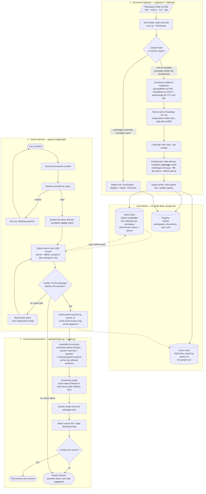

# Sanad

A local-first document assistant. You point it at a folder of documents, press
**Sync**, and ask questions in French. Every answer carries its sources; when the
documents do not hold the answer, Sanad refuses honestly instead of inventing one.

One Python process on your machine, three local stores beside it. The only thing
that leaves the machine is a prompt to the configured answering model, and even
that has a fully local mode (Ollama).

**Stack:** Python 3.12, uv, FastAPI serving server-rendered templates, LangGraph, Qdrant
(embedded), SQLite, `intfloat/multilingual-e5-base`.

**Status:** in build. Sprint-0 foundation is merged; the pipeline below is the
signed target architecture, not all of it is coded yet. The live picture of what
works today is [BUILD-STATE.md](docs/journal/BUILD-STATE.md).

---

## The pipeline

Three phases: documents become searchable chunks (ingestion), a question becomes
graded passages (retrieval), and those passages become a sourced answer or a
refusal (prompt generation).



Throughout phases 2 and 3 the trace collector records every search string, every
file consulted, and every retry onto the answer object. V1 persists it beside the
answer; V1.1 renders it in the UI (F-10).

### Why the details in that diagram matter

| Step | The trap it avoids |
|---|---|
| `passage:` and `query:` prefixes | E5 raises no error without them; retrieval quality just silently degrades. A unit test enforces both (ADR-05). |
| Conversion ladder, not one converter | `markitdown` strips heading structure from PDFs, and the parent splitter cuts on headings. PDFs stay on the heading-preserving path (ADR-07). |
| Parent/child split | Children of 500 chars are precise to search and fit E5's 512-token ceiling; parents give the model enough context to answer. |
| One Qdrant collection per workspace | Isolation is structural, not a filter you can forget to apply (ADR-04). |
| The source guard before rendering | An answer with no sources routes to the refusal path instead of rendering as final (gate G3). |
| Retry ceiling from config | Never hardcoded, so the grader loop cannot spin (F-04). |

Scanned PDFs are reported **Skipped with reason** by default. F-16 adds an
opt-in OCR rung to the same ladder — see "Enabling OCR for scanned PDFs" below.

---

## Quickstart

```bash
uv sync                      # environment from the committed lockfile
cp .env.example .env         # then fill in the model provider settings
uv run python app.py         # starts the app at 127.0.0.1
```

The first Sync downloads the embedding model once, then it is cached locally.

| Task | Command |
|---|---|
| Run the app | `uv run python app.py` |
| Tests | `uv run pytest -q` |
| Lint | `uv run ruff check .` |
| End-to-end | `uv run pytest tests/integration -q` |

New to the project? Start with [docs/START-HERE.md](docs/START-HERE.md).

### Enabling OCR for scanned PDFs (F-16, off by default)

A scanned PDF (no text layer) is Skipped with a reason unless OCR is turned
on. OCR uses PyMuPDF's own built-in Tesseract, so there is nothing to
install beyond the language data files:

1. Download the three `.traineddata` files you need from
   [tessdata_fast](https://github.com/tesseract-ocr/tessdata_fast) (e.g.
   `fra.traineddata`, `ara.traineddata`, `eng.traineddata`) into one folder.
2. Set `OCR_TESSDATA_DIR` in `.env` to that folder's path.
3. Optionally set `OCR_LANGUAGES` (default `fra+ara+eng`), `OCR_DPI`
   (default `300`), and `OCR_MAX_PAGES` (default `200`).

A missing folder or a missing language file fails loud at startup rather
than silently at Sync time. Not set on Railway/Docker by default (no
tessdata ships there).

## Signing in (S6)

`AUTH_MODE` picks one of three, and the default changes nothing:

| `AUTH_MODE` | What it is |
|---|---|
| `none` (default) | local-first: no login, everything allowed, exactly as before (ADR-13) |
| `password` | one shared password for the whole instance (`ACCESS_PASSWORD`), used by the published demo |
| `keycloak` | named people with roles: **admin**, **curator**, **reader** |

With `keycloak`, Sanad never sees a password: it redirects to your realm,
exchanges the code server-to-server, and reads the roles from Keycloak's
introspection endpoint. Roles are realm roles named `sanad-admin`,
`sanad-curator`, `sanad-reader` (prefix configurable). Someone with no
Sanad role can sign in and is told to ask an administrator; they see
nothing else. Non-admins see only the workspaces they were granted.

A realm for development, in five steps (about three minutes):

1. `docker compose -f compose.keycloak.yaml up -d` with `KEYCLOAK_ADMIN_USER`
   and `KEYCLOAK_ADMIN_PASSWORD` set in your shell.
2. In the admin console at http://localhost:8080, create a realm `sanad`.
3. Create a client `sanad`: client authentication ON, standard flow ON,
   valid redirect URI `http://127.0.0.1:8000/auth/callback`, and valid
   POST LOGOUT redirect URI `http://127.0.0.1:8000/auth/login` (without
   that second one Keycloak answers 400 when you sign out).
4. Realm roles: `sanad-admin`, `sanad-curator`, `sanad-reader`. Create a
   user and assign one.
5. Put the client's secret in `.env` as `KEYCLOAK_CLIENT_SECRET`, with
   `AUTH_MODE=keycloak` and `KEYCLOAK_ISSUER=http://localhost:8080/realms/sanad`.

No realm export ships in this repository on purpose: an export carries the
client secret, and a secret never goes into a committed file.

## Documentation map

| Document | What it settles |
|---|---|
| [PRD](docs/phase2/Sanad_PRD_v1.0.md) | What the product does: features F-01 to F-16 with acceptance criteria |
| [Architecture](docs/phase2/Sanad_Architecture_v1.0.md) | How it is built: module map, runtime flows, data layer, stack pins, ADRs |
| [Project plan](docs/phase2/Sanad_ProjectPlan_v1.0.md) | When and by whom: stories ST-01 to ST-52 |
| [BUILD-STATE](docs/journal/BUILD-STATE.md) | What is actually working right now |
| [DECISIONS](docs/journal/DECISIONS.md) | Every real choice and its trade-off |
| [S6 login design](docs/design/S6-auth-rbac.md) | How login, roles and the activity log work, and why no new dependency |

## Data locality

Everything derived lives under `data/` on your disk — `data/qdrant/`,
`data/parents/`, `data/sanad.db`, `data/reports/` — and all of it is git-ignored.
Your source folders stay wherever you put them; Sanad only reads them. There is
no telemetry and no external observability service. In strict-local mode, nothing
leaves the machine at all.

## Releases are evaluation-gated

A release ships only when the golden-set run passes three gates: groundedness
≥ 0.90 (G1), 20/20 correct refusals on out-of-scope questions (G2), and sources
on 100% of answers (G3). The gate script returns a non-zero exit code otherwise
and the release stops there.
