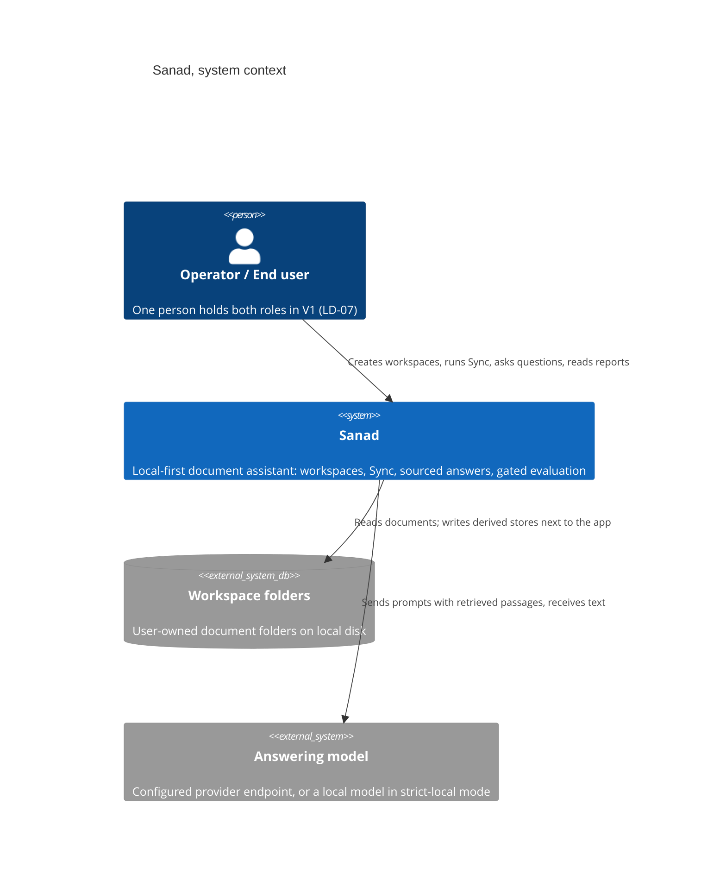
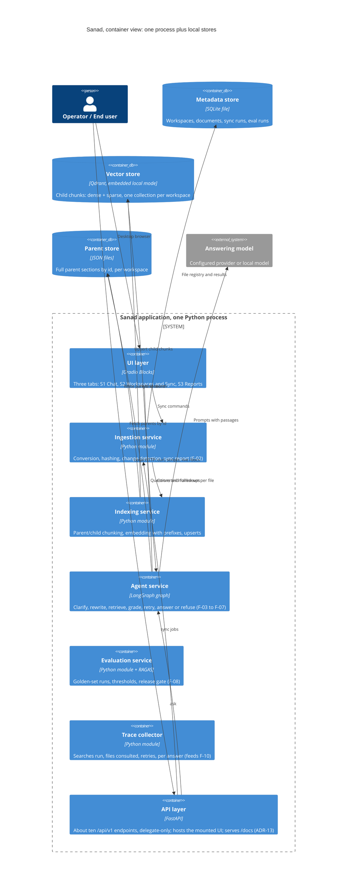
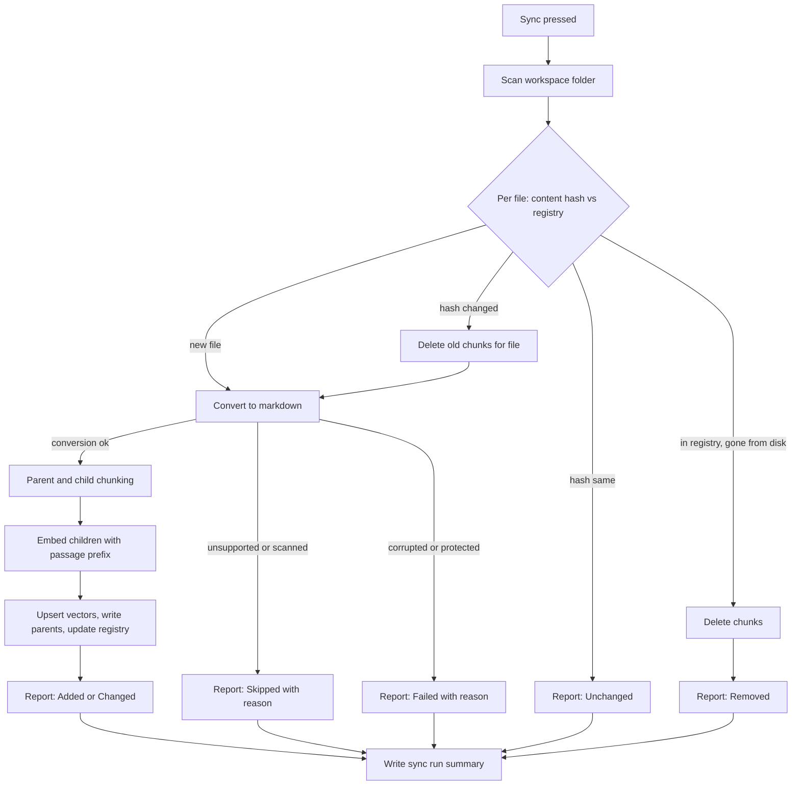
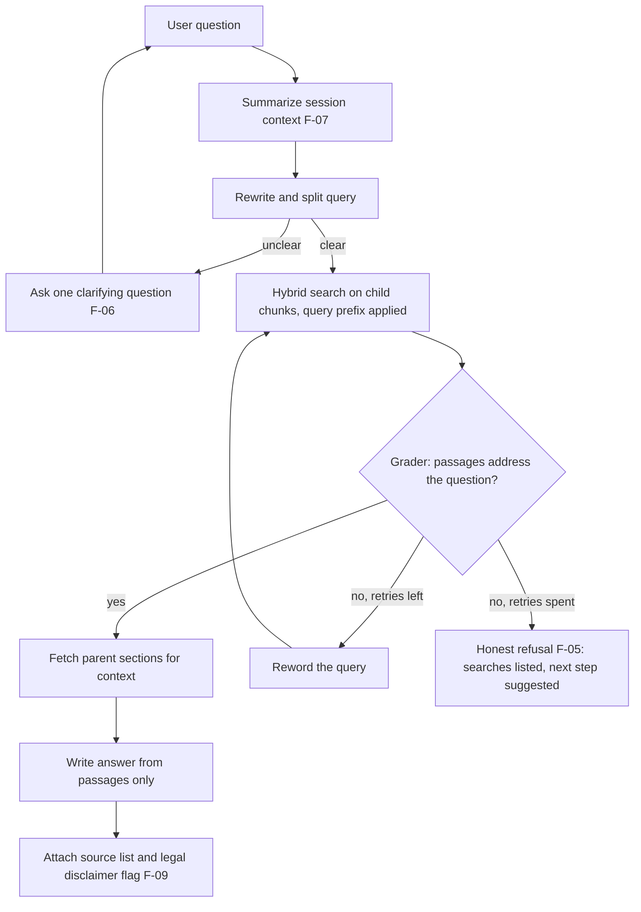
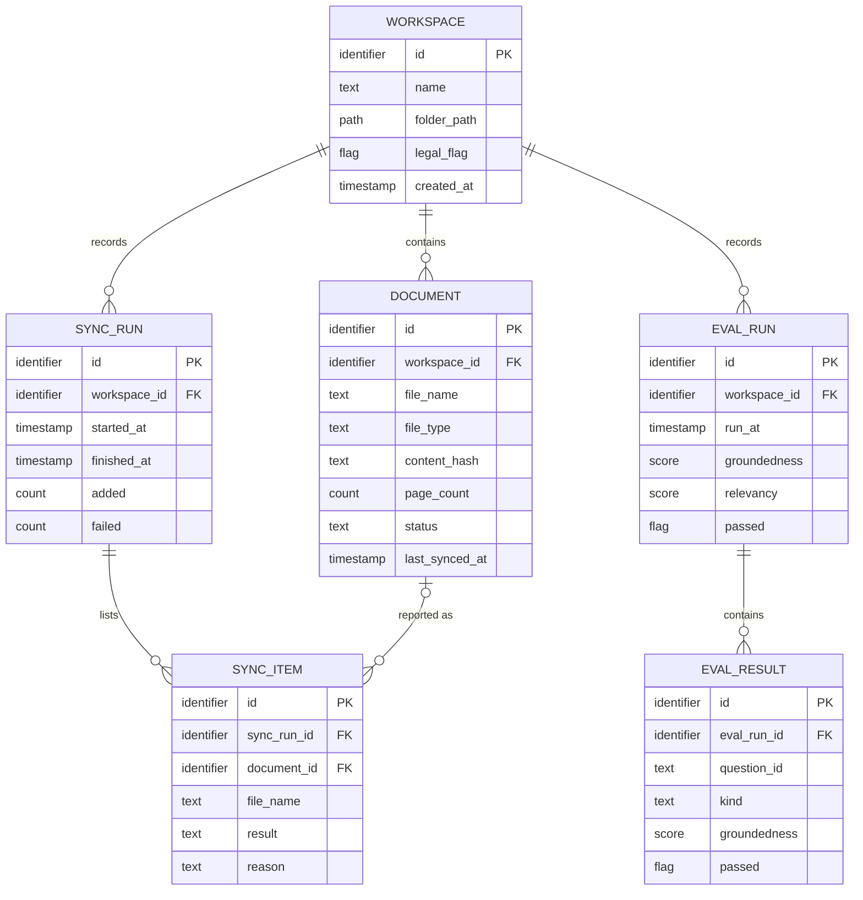
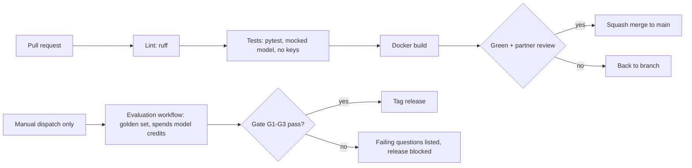

# Sanad: Architecture and Delivery Design (S1-S4)

| Field | Value |
|---|---|
| Document | Architecture and Delivery Design, v1.1 |
| Date | 2026-07-20 |
| Status | Signed v1.1, amended 2026-07-20 by CR-01 (thin API layer), human ruling: option 2 |
| Prepared by | Delivery chain stages S1 Software Architect, S2 Tech Lead / Tech Scout, S3 DevOps-SRE Lead, S4 Lead QA Engineer, compressed into one artifact on the human's ruling |
| Binding inputs | Sanad PRD v1.0 (signed); D1-close packet (locked decisions LD-01 to LD-08) |
| Verification rule | Every pinned tool or model was checked against a live source this session, or carries an explicit tag. Bibliography at the foot. |

**How to read this document.** Sections 1 to 6 are the architect's work (structure and ADRs). Section 7 is the data layer. Section 8 is the tech lead's verified stack. Sections 9 and 10 map quality and security requirements to mechanisms. Sections 11 to 13 are the DevOps plan (repo, environments, git, CI/CD). Section 14 is the QA strategy. Nothing here reopens the PRD; one risk is escalated, no change requests raised.

## 0. Chain constants disposition

| Constant | Disposition |
|---|---|
| Keycloak 26.6.x | Not applicable in V1. LD-07 locks single-user with no authentication. Revisit if V2 adds accounts. |
| Orval 8.x | Still not applicable for code generation: no TypeScript client is built. An OpenAPI contract now exists (ADR-13, `docs/api/openapi.yaml`), served live at `/docs`. |
| Node.js >= 22.18 | Not applicable. No JavaScript toolchain in V1. |
| PostgreSQL >= 13 | Honored as the reference DDL dialect (section 7). The runtime engine is SQLite (ADR-08); every deviation carries a dictionary note. `gen_random_uuid()` in the reference DDL is built in from PostgreSQL 13, matching the floor. |
| Mermaid-only diagrams | Honored throughout. |

## 1. System overview

Sanad is a local-first application: one Python process on the operator's machine, a browser UI, and three local stores beside it. The only thing that ever leaves the machine is a prompt to the configured answering model, and even that has a fully local mode. Think of it as a workshop, its shelves, and one phone line out.

Design principles, in order of authority:

1. **PRD contract first.** Sources on every answer, honest refusals, gated releases (G1-G3) shape the agent before anything else does.
2. **Data locality (LD-06).** Documents, vectors, metadata, and reports live on operator-controlled disk.
3. **Two people, four weeks.** Every component must be explainable by its owner in one minute at the defense. Complexity that cannot be explained gets cut or deferred.
4. **Swap points over cleverness.** The model provider, the embedding model, and the converter are configuration, so a failed pin costs a config change, never a redesign.

## 2. Context (C4 level 1)



## 3. Containers (C4 level 2)



## 4. Module map and PRD feature coverage

One Python package, six modules, one owner per module at any moment. The table is the completeness check: every PRD feature lands somewhere.

| Module | Owns | PRD features served |
|---|---|---|
| `ingestion` | Folder scan, content hashing, change detection, format conversion ladder, sync report | F-02, F-11 (V1.1), F-16 skip rule |
| `indexing` | Markdown-header parent split, child split, embedding calls with mandatory prefixes, vector and parent store writes, workspace isolation | F-01, supports F-03 |
| `agent` | LangGraph graph: session summary, rewrite and split, clarification pause, hybrid retrieve, relevance grade, reword retry, answer with sources, honest refusal, disclaimer flag | F-03, F-04, F-05, F-06, F-07, F-09, F-12 (V1.1) |
| `evaluation` | Golden-set loader, RAGAS metric runs, refusal checks, thresholds, report writer, gate script | F-08, gates G1-G3 |
| `ui` | Three Gradio tabs, all empty/loading/error states from PRD section 8, trace panel (V1.1) | Screens S1-S3, F-10 (V1.1), F-15 (V2) |
| `api` | FastAPI process host: about ten localhost endpoints under `/api/v1` delegating to the same service functions the UI calls; serves the live schema at `/docs` (ADR-13, CR-01) | Delivery seam; no PRD feature of its own |
| `db` | SQLite schema, data access, migrations-by-script | Registry behind F-01, F-02, F-08 |

Deferred by design, matching PRD releases: live watcher (F-13), Arabic and RTL content path (F-14), feedback (F-15), OCR (F-16). Each has a named landing spot (watcher wraps `ingestion.sync`; Arabic swaps the embedding model and adds an RTL rendering path in `ui`; OCR is one more rung on the conversion ladder). Deferral is cheap because the seams already exist.

## 5. Runtime flows

### 5.1 Sync (F-02)



A second Sync during a run is rejected with a message (PRD failure table). Every branch ends in the report; no silent outcomes.

### 5.2 Question answering (F-03 to F-07, F-09)



The retry ceiling defaults to 2 and is operator-configurable (PRD F-04). The trace collector records every search string, file consulted, and retry, per answer; V1 stores it, V1.1 shows it (F-10).

### 5.3 Evaluation and release gate (F-08)

Golden set in, one row per question out (groundedness, relevancy, refusal correctness), one dated report, one exit code. The gate script returns non-zero when G1 (groundedness >= 0.90), G2 (refusals 20/20), or G3 (sources on 100% of answers) fails, and the release stops there.

## 6. Architecture decision records

Each ADR: decision, alternative considered, why this one, cost accepted. Status of all: proposed, signed together with this document.

**ADR-01. Local-first modular monolith.** One Python process with six modules (section 4). Alternative: client-server split or microservices. Why: two people, four weeks, demo-grade availability, and LD-06 locality all point one way; module seams keep a later split possible. Cost: no independent scaling, which V1 does not need.

**ADR-02. UI on Gradio Blocks.** Three tabs implement PRD screens S1-S3, including every empty, loading, and error state. Alternative: a separate JavaScript frontend with an API layer. Why: the PRD demands a desktop-browser web app, and Gradio delivers chat, file tables, and progress in Python, cutting an entire toolchain for a two-person team. Cost: less visual polish and layout control; accepted for a defense MVP, and the reference implementation uses the same UI family, shortening the learning path [2]. Amended 2026-07-20 by ADR-13 (CR-01): the process host becomes FastAPI and the Gradio UI mounts onto it unchanged.

**ADR-03. Agent as a LangGraph graph.** Nodes for summary, rewrite-and-split, clarification pause, retrieval, grading, reword retry, answer, refusal. Alternative: a hand-rolled loop. Why: the exact pattern (decide to retrieve, grade documents, rewrite the question, answer) is the documented standard in the framework's own tutorial [1], and the reference implementation extends it with clarification, memory, and parallel sub-queries [2]; a graph also makes the F-04 retry ceiling and the F-05 refusal path explicit and testable. Cost: one framework to learn; mitigated by the two documented sources the team will study first.

**ADR-04. Vector store: Qdrant in embedded local mode, one collection per workspace.** Alternative: a client-server vector database or a single shared collection with filters. Why: embedded mode means zero servers to run (LD-06, budget), and collection-per-workspace makes F-01 isolation structural instead of a filter you can forget. Cost: no concurrent multi-process access; irrelevant for a single-process app.

**ADR-05. Embeddings: dense `intfloat/multilingual-e5-base` locally, sparse BM25, hybrid retrieval.** Alternatives: `BAAI/bge-m3`, a hosted embedding API, or an English-only model. Why: the corpus is French; an English-tuned model is disqualified. On commodity CPU hardware, the multilingual-E5 family closes almost the entire quality gap against a top hosted model on short-passage, single-language corpora at a fraction of the latency [6], and our searched units are child chunks of 500 characters, well under the model's 512-token input limit [10]. BGE-M3 is the recorded upgrade path (100+ languages, dense plus sparse, 8,192-token inputs, top multilingual benchmark results [7]) if the golden set exposes retrieval weakness or a GPU appears. Hosted embeddings lose on LD-06 and cost. **Binding implementation rule:** every indexed chunk is embedded with the `passage: ` prefix and every query with `query: `; the model card requires it even for non-English text [4], and a documented field failure shows that omitting the prefixes raises no error while retrieval quality silently degrades [5]. A unit test enforces the rule (section 14). Cost: French BM25 tokenization is imperfect; the multilingual dense side compensates, and the golden set measures the blend.

**ADR-06. Answering model: provider-agnostic, two modes.** A single configuration point selects the chat model. Cloud-key mode uses the team's API key for answer quality; strict-local mode runs a local model through the same interface for full data locality and the offline demo fallback. Alternative: hard-wiring one provider. Why: the reference implementation demonstrates the one-line provider swap [2], LD-06 demands a locality answer, and risk R4 demands an offline path. Local-mode floor: an instruction-following model of 7B parameters or more, because smaller models ignore retrieval instructions or hallucinate, per the reference project's troubleshooting guidance [2]. Cost: two modes to test; the mocked-model test layer (section 14) covers logic either way. Cloud-mode data-use terms are a pre-demo checklist item, not a claim made here (open risk OR-2).

**ADR-07. Conversion ladder: `pymupdf4llm` for PDF, `markitdown` for DOCX now and PPTX in V1.1, passthrough for TXT and MD.** Alternative: one converter for everything. Why: the parent splitter cuts on markdown headings, and the PDF converter must preserve them; `markitdown` is documented to strip heading structure from PDFs and to fail on scanned PDFs without OCR [3], so it takes the office formats where it is strong and PDFs stay on the heading-preserving path proven in the reference implementation [2]. Scanned PDFs are Skipped with reason, the binding LD-03 behavior. Cost: two converter dependencies instead of one; each is one function behind one interface.

**ADR-08. Metadata in SQLite; parents as JSON files; PostgreSQL stays the reference DDL dialect.** Alternative: run PostgreSQL. Why: the registry is small, single-writer, and local; SQLite ships in the standard library and needs zero operations, which two people in four weeks will feel every day. The chain constant is honored by writing the data dictionary engine-neutral and the reference DDL in PostgreSQL dialect, with every SQLite deviation noted (section 7), so a future server deployment is a dialect port, never a redesign. Parent sections stay as JSON files keyed by id, matching the reference pattern [2] and keeping big text blobs out of the registry. Cost: no concurrent writers; a single-process app has one.

**ADR-09. Trace collection in-process.** The agent emits structured steps (search strings, files, retries) onto the answer object; V1 persists them beside the answer, V1.1 renders them (F-10). Alternative: an external observability service. Why: an external dependency adds setup, an account, and a data-egress question under LD-06, for data we can capture in twenty lines. Cost: no fancy dashboards; the defense demo only needs the per-answer trace.

**ADR-10. Environment: `uv` with a committed lockfile; Docker image for the demo.** Alternative: bare `pip` and a requirements file, or no container. Why: the lockfile makes both laptops and the CI runner byte-identical, which is the cheapest insurance a two-machine team can buy; the Docker image is the rehearsed fallback machine for risk R4 and the one-command demo start. Cost: one tool to install once.

**ADR-11. Git: trunk-based with protected main.** Short-lived branches named `feat/S<sprint>-<story>-<slug>`, `fix/...`, `docs/...`, `chore/...`; Conventional Commits; squash merge only; no direct pushes to main; release tags `v1.0.0`, `v1.1.0` aligned to PRD releases. Every pull request needs the partner's review before merge. The review is honest for a mixed-skill pair because the checklist is behavioral: acceptance criteria named, demo script run, journal updated, tests green (section 13). Cost: process overhead two people can absorb, and exactly the discipline the defense should see.

**ADR-12. CI on GitHub Actions, cost-gated evaluation.** Every pull request runs lint, the mocked-model test suite, and a Docker build, with no API keys involved. The golden-set evaluation is a separate manually dispatched workflow because it spends real model credits; the dispatch itself is the authorization step. Cost: evaluation is not fully automatic; for a spend-money job, that is the point.

**ADR-13 (CR-01, 2026-07-20). Thin real API on FastAPI; Gradio mounts on it.** FastAPI becomes the process host. About ten endpoints under `/api/v1` (workspaces, sync jobs, ask, evaluation reads, health) delegate to the same service functions the UI calls in-process: two doors, one room, zero duplicated logic. The Gradio Blocks UI mounts at `/` through the official `gr.mount_gradio_app(parent_app, blocks, path)` API, whose documented parameters are exactly the parent FastAPI app, the blocks object, and the mount path [11]. The live schema serves at `/docs`; the committed `docs/api/openapi.yaml` is the contract of record, and a CI drift test fails when served schema and committed contract diverge. The server binds to 127.0.0.1 with no authentication, by design and stated in the spec (LD-07, single-user V1). Two deliberate exclusions: no evaluation-trigger endpoint (the cost gate of ADR-12 stays a human click) and no traces endpoint until F-10 lands, when the contract bumps to v1.1, because a contract listing unserved routes would fail its own drift test. Alternative rejected: contract-as-documentation with no served API, which produces a YAML the jury can disprove with one curl. Negative findings, logged with status: two old mount issues exist, a 2023 event-loop failure when mounting an already-launched interface and a 2024 queue failure when mounting inside a lifespan hook on gradio 4.38 [12]; the plain documented order (build app, mount, run) avoids both, and ST-51's tests would catch any recurrence. Cost: about five story points and one more seam to test.

## 7. Data architecture

### 7.1 Engine-neutral data dictionary (source of truth)

Neutral types: `identifier`, `text`, `flag`, `timestamp`, `count`, `score` (0.000 to 1.000), `path`.

| Entity | Field | Type | Notes |
|---|---|---|---|
| workspace | id | identifier | Generated |
| workspace | name | text | Unique |
| workspace | folder_path | path | User-owned folder (LD-06) |
| workspace | legal_flag | flag | Drives the F-09 disclaimer |
| workspace | created_at | timestamp | |
| document | id | identifier | |
| document | workspace_id | identifier | Owner workspace; delete cascades |
| document | file_name | text | Unique inside a workspace |
| document | file_type | text | pdf, docx, txt, md, pptx |
| document | content_hash | text | Change detection (F-02) |
| document | page_count | count | Nullable for non-paged types |
| document | status | text | active, failed, skipped, removed |
| document | last_synced_at | timestamp | Nullable |
| sync_run | id, workspace_id, started_at, finished_at | | Plus six counters: added, changed, unchanged, failed, removed, skipped |
| sync_item | id, sync_run_id, document_id, file_name, result, reason | | One row per file per run; document_id nullable (file may never register) |
| eval_run | id, workspace_id, run_at, groundedness, relevancy, refusal_pass, refusal_total, passed, report_path | | One row per golden-set run (F-08) |
| eval_result | id, eval_run_id, question_id, kind, groundedness, relevancy, passed | | kind: in_scope or out_of_scope |

Not in the registry, by decision: conversations (session-only per PRD F-07 and the no-learning non-goal), chunks (they live in the vector and parent stores), golden-set questions (versioned files in the repo, reviewed like code).

### 7.2 ERD



### 7.3 Reference DDL (PostgreSQL dialect, per chain constant)

```sql
-- Reference dialect: PostgreSQL >= 13 (gen_random_uuid built in from 13).
-- Runtime engine in V1 is SQLite; deviations listed in 7.4.
-- Deleting a workspace cascades to every derived row by design (PRD F-01:
-- derived data removed, source files on disk untouched). Running any
-- destructive statement (DROP, DELETE, TRUNCATE) against real data:
-- REQUIRES-HUMAN-AUTHORIZATION.

CREATE TABLE workspace (
  id             uuid        PRIMARY KEY DEFAULT gen_random_uuid(),
  name           text        NOT NULL UNIQUE,
  folder_path    text        NOT NULL,
  legal_flag     boolean     NOT NULL DEFAULT false,
  created_at     timestamptz NOT NULL DEFAULT now()
);

CREATE TABLE document (
  id             uuid        PRIMARY KEY DEFAULT gen_random_uuid(),
  workspace_id   uuid        NOT NULL REFERENCES workspace(id) ON DELETE CASCADE,
  file_name      text        NOT NULL,
  file_type      text        NOT NULL,
  content_hash   text        NOT NULL,
  page_count     integer,
  status         text        NOT NULL CHECK (status IN ('active','failed','skipped','removed')),
  last_synced_at timestamptz,
  UNIQUE (workspace_id, file_name)
);

CREATE TABLE sync_run (
  id             uuid        PRIMARY KEY DEFAULT gen_random_uuid(),
  workspace_id   uuid        NOT NULL REFERENCES workspace(id) ON DELETE CASCADE,
  started_at     timestamptz NOT NULL DEFAULT now(),
  finished_at    timestamptz,
  added          integer     NOT NULL DEFAULT 0,
  changed        integer     NOT NULL DEFAULT 0,
  unchanged      integer     NOT NULL DEFAULT 0,
  failed         integer     NOT NULL DEFAULT 0,
  removed        integer     NOT NULL DEFAULT 0,
  skipped        integer     NOT NULL DEFAULT 0
);

CREATE TABLE sync_item (
  id             uuid        PRIMARY KEY DEFAULT gen_random_uuid(),
  sync_run_id    uuid        NOT NULL REFERENCES sync_run(id) ON DELETE CASCADE,
  document_id    uuid        REFERENCES document(id) ON DELETE SET NULL,
  file_name      text        NOT NULL,
  result         text        NOT NULL CHECK (result IN ('added','changed','unchanged','failed','removed','skipped')),
  reason         text
);

CREATE TABLE eval_run (
  id             uuid          PRIMARY KEY DEFAULT gen_random_uuid(),
  workspace_id   uuid          NOT NULL REFERENCES workspace(id) ON DELETE CASCADE,
  run_at         timestamptz   NOT NULL DEFAULT now(),
  groundedness   numeric(4,3),
  relevancy      numeric(4,3),
  refusal_pass   integer       NOT NULL DEFAULT 0,
  refusal_total  integer       NOT NULL DEFAULT 0,
  passed         boolean       NOT NULL DEFAULT false,
  report_path    text
);

CREATE TABLE eval_result (
  id             uuid          PRIMARY KEY DEFAULT gen_random_uuid(),
  eval_run_id    uuid          NOT NULL REFERENCES eval_run(id) ON DELETE CASCADE,
  question_id    text          NOT NULL,
  kind           text          NOT NULL CHECK (kind IN ('in_scope','out_of_scope')),
  groundedness   numeric(4,3),
  relevancy      numeric(4,3),
  passed         boolean       NOT NULL
);
```

### 7.4 SQLite deviations (dictionary notes)

| Reference (PostgreSQL) | SQLite runtime | Neutral meaning kept |
|---|---|---|
| `uuid` + `gen_random_uuid()` | `TEXT`, UUID generated by the application | identifier |
| `timestamptz` + `now()` | `TEXT` in ISO-8601 UTC, set by the application | timestamp |
| `boolean` | `INTEGER` 0/1 | flag |
| `numeric(4,3)` | `REAL` | score |
| `CHECK (... IN ...)` | Same syntax, supported | enumerated text |
| `REFERENCES ... ON DELETE CASCADE` | Same syntax; requires `PRAGMA foreign_keys = ON` at every connection open, enforced in `db/repo.py` | ownership and cascade |

### 7.5 Derived stores and filesystem layout

- **Vector store:** Qdrant embedded mode, storage path `data/qdrant/`. One collection per workspace named `ws_<workspace_id>_children`. Point payload: `parent_id`, `source_file`, `section_label`, `chunk_text`. Dense vector 768-dim (E5-base), sparse vector BM25.
- **Parent store:** `data/parents/<workspace_id>/<parent_id>.json`, each file holding the parent's full text and metadata (`source_file`, `section_label`).
- **Registry:** `data/sanad.db` (SQLite).
- **Reports:** `data/reports/<workspace_id>/<run_at>.json`, referenced from `eval_run.report_path`.
- All of `data/` is git-ignored and lives on the operator's disk (LD-06). Workspace source folders stay wherever the user put them; Sanad only reads them.

Chunking parameters, carried from the studied reference pattern [2] and tunable in config: parents split on markdown headings H1-H3, merged below 2,000 characters, split above 4,000; children 500 characters with 100 overlap. Child size keeps every embedded input far below the E5 512-token ceiling [10].

## 8. Verified stack (S2)

Floors below are the pin authority until the lockfile exists; the committed `uv.lock` then becomes the exact-version authority. Verification status names the source and session date.

| Component | Pin | Role | Verification |
|---|---|---|---|
| Python | >= 3.11, target 3.12 | Runtime | Reference project requires 3.11+ [2], checked 2026-07-19 |
| langgraph | >= 1.1 | Agent graph | Reference project pins the 1.1+ line [2]; official tutorial current [1], checked 2026-07-19 |
| langchain + provider packages | 1.x line; `langchain-ollama`, plus the team's cloud provider package | Model interface, one-line swap | Tutorial and reference project [1][2], checked 2026-07-19 |
| qdrant-client + langchain-qdrant | current stable | Embedded vector store, hybrid mode | Pattern verified in reference project [2], checked 2026-07-19 |
| sentence-transformers + `intfloat/multilingual-e5-base` | model as named | Dense multilingual embeddings, 768-dim, 512-token inputs | Model card [4] and CPU benchmark [6], checked 2026-07-20 |
| FastEmbed sparse `Qdrant/bm25` | current stable | Sparse side of hybrid | Pattern verified in reference project [2], checked 2026-07-19 |
| pymupdf4llm | current stable | Heading-preserving PDF to markdown | Usage verified in reference project [2], checked 2026-07-19 |
| markitdown[all] | current stable, Python 3.10+ | DOCX now, PPTX in V1.1 | Repo README active May 2026 [3]; limitations source [3], checked 2026-07-19 |
| gradio | >= 5 | UI layer | Floor from the maintained Gradio line used by the reference project's interface [2]; exact pin resolved at lockfile time, tagged [UNVERIFIED exact version, resolve at `uv lock`] |
| ragas | current stable | Faithfulness and relevancy metrics for F-08 | Metric definitions and LangChain integration verified [8], checked 2026-07-20 |
| pydantic-settings | current stable | Config from `.env` | Standard; exact pin at lockfile time |
| pytest, ruff | current stable | Tests, lint | Standard; exact pins at lockfile time |
| uv | current stable | Env and lockfile | ADR-10; exact pin at lockfile time |
| Local model floor (strict-local mode) | instruction-following, >= 7B parameters | Answering model fallback | Reference project troubleshooting: smaller models ignore retrieval instructions or hallucinate [2], checked 2026-07-19 |
| fastapi + uvicorn | resolved by lockfile alongside gradio | API process host and server (ADR-13) | Gradio is FastAPI-native: `mount_gradio_app` takes a parent `fastapi.FastAPI` [11], and both packages already arrive inside Gradio's own dependency set [12], checked 2026-07-20 |
| pyyaml | current stable | Loads the committed contract in the drift test | Standard; exact pin at lockfile time |

Excluded on purpose: `watchdog` (F-13 is V2), any external observability service (ADR-09), any hosted embedding API (ADR-05), authentication stack (LD-07).

## 9. Quality targets mapped to mechanisms (PRD G1-G6)

| Target | Mechanism | Measurement |
|---|---|---|
| G1 groundedness >= 90% | Answer node writes only from retrieved passages; RAGAS faithfulness scores each golden answer, meaning factual consistency of the answer with the retrieved context [8] | `evaluation.gate`, every release |
| G2 refusals 20/20 | Explicit refusal path after the retry ceiling; refusal detector asserts the refusal shape on out-of-scope questions | Same gate |
| G3 sources 100% | The answer object requires a non-empty source list before the UI renders it as final | Gate plus UI inspection |
| G4 median <= 20 s, p95 <= 60 s | Tuning knobs in config: retrieval depth k, retry ceiling, model choice | `scripts/measure_latency.py`, 20 timed questions on the reference machine |
| G5 200 pages <= 10 min | Batch embedding; E5-base chosen for CPU latency [6]; knob: swap to E5-small if needed | `scripts/measure_sync.py` on the labor corpus |
| G6 >= 9/10 clean rehearsals | Docker image freezes the demo environment; scripted demo; offline strict-local mode rehearsed | Rehearsal log template in `docs/` |

Escalated risk, unchanged from the PRD (R2): G4 and G5 are targets, not measurements. The first sprint carries a mandatory spike: index the labor code, run the 20-question timing, and report numbers. If a target fails on the reference machine, this document's tuning knobs come first; if they are not enough, a change request goes to the PRD with the measurements attached.

## 10. Security and data locality (LD-06)

- Every store (`data/`) sits on operator-controlled disk; nothing syncs anywhere.
- Secrets live in `.env`, git-ignored; `.env.example` documents every variable with placeholders. The CI evaluation key lives in a GitHub Actions secret. Rotating or adding repository secrets: REQUIRES-HUMAN-AUTHORIZATION.
- No telemetry, no analytics, no external observability (ADR-09).
- Cloud-key mode sends prompts plus retrieved passages to the configured provider. Before the defense, the checklist item OR-2 verifies the chosen provider's current data-use and retention terms; this document deliberately claims nothing about them. Strict-local mode exists precisely so the locality answer never depends on a vendor page.
- The demo corpus is public material (PRD constraint), which caps the blast radius of any mistake while the team learns.

## 11. Repository structure

One repository, created fresh on GitHub, both teammates as collaborators. The studied reference project is cloned into a separate local folder outside this repo, read-only.

```
sanad/
  app.py                      # FastAPI host; mounts the Gradio UI (ADR-13)
  config.py                   # pydantic-settings, reads .env
  ingestion/
    convert.py                # conversion ladder (ADR-07)
    hashing.py                # content hashes
    sync.py                   # scan, diff, report (F-02)
  indexing/
    chunking.py               # parent/child split (7.5)
    embeddings.py             # E5 with mandatory prefixes (ADR-05)
    vector_store.py           # Qdrant embedded, per-workspace collections
    parent_store.py           # JSON parent files
  agent/
    graph.py                  # LangGraph wiring (5.2)
    nodes.py                  # summary, rewrite, grade, answer, refusal
    prompts.py                # all system prompts, versioned in git
    trace.py                  # trace collector (ADR-09)
  evaluation/
    golden/                   # question files, French, reviewed like code
    runner.py                 # RAGAS runs (F-08)
    gate.py                   # thresholds, exit code
  ui/
    chat_tab.py               # screen S1
    workspaces_tab.py         # screen S2
    reports_tab.py            # screen S3
  db/
    schema.sql                # SQLite DDL per 7.4
    repo.py                   # data access, PRAGMA foreign_keys ON
  api/
    routes.py                 # /api/v1 endpoints, delegate-only (ADR-13)
    schemas.py                # request and response models mirroring the contract
tests/
  unit/  integration/  fixtures/
docs/
  Sanad_PRD_v1.0.md  Sanad_Architecture_v1.0.md  adr/  api/openapi.yaml  journal.md  demo_script.md
scripts/
  measure_latency.py  measure_sync.py
.github/workflows/
  ci.yml  eval.yml
Dockerfile  compose.yaml  .env.example  pyproject.toml  README.md
```

`docs/journal.md` is the issue journal both owners feed continuously; it becomes the "problems met and solved" chapter of the report.

## 12. Environments, git workflow, CI/CD (S3)

### 12.1 Developer environment, both machines

1. Install `uv` and Git; clone the repo.
2. `uv sync` (creates the environment from the lockfile).
3. `cp .env.example .env`, fill the model provider settings.
4. Strict-local option: install the local model runtime and pull an instruction model of 7B+ (ADR-06).
5. `uv run python app.py` starts the UI; `uv run pytest` runs the suite; first Sync downloads the embedding model once, then it is cached locally.
6. Docker route for the demo and the fallback machine: `docker compose up` runs the same app with `data/` mounted as a volume.

### 12.2 Git rules (ADR-11)

- `main` is protected: no direct pushes, no force pushes, required CI green, required one review. Changing protection rules: REQUIRES-HUMAN-AUTHORIZATION.
- Branches: `feat/S<sprint>-<story-id>-<slug>`, `fix/<issue-id>-<slug>`, `docs/<slug>`, `chore/<slug>`. One story, one branch, short-lived.
- Commits follow Conventional Commits (`feat:`, `fix:`, `docs:`, `test:`, `chore:`), which keeps history readable and release notes free.
- Merges are squash-only; the PR title becomes the commit.
- Releases are annotated tags `v1.0.0`, `v1.1.0`, matching PRD section 12, cut only after the evaluation gate passes.

Pull request checklist (the PR template):

1. Story or feature id named, acceptance criteria listed and checked.
2. Tests green locally; new logic carries new tests.
3. Demo script still runs (reviewer executes it).
4. `docs/journal.md` updated when a problem was met and solved.
5. No secrets, no `data/` files, no generated stores in the diff.

The review split is honest for a mixed-skill pair: the build owner reviews code mechanics; the research and quality owner reviews behavior against acceptance criteria by running the app and the demo script. Both reviews count; the partner's approval is the merge key either way.

### 12.3 CI/CD pipeline (ADR-12)



`ci.yml` runs on every pull request and on main; its pytest stage includes the contract-drift test, so an endpoint change without the matching `docs/api/openapi.yaml` change fails CI (ADR-13). `eval.yml` runs only on manual dispatch because it spends real credits; the dispatch click is the human authorization, and its API key comes from the repository secret. REQUIRES-HUMAN-AUTHORIZATION applies to dispatching `eval.yml` and to any workflow change that touches secrets.

## 13. QA strategy (S4)

### 13.1 Test pyramid

- **Unit (fast, no model, every PR):** hashing and change-detection state machine (new, changed, unchanged, removed); parent merge and split boundaries (2,000 and 4,000); the prefix rule, a test asserting every embedded chunk text starts with `passage: ` and every query with `query: `, which converts the silent-degradation trap [5] into a loud red test; refusal detector shape; SQLite cascade behavior with `PRAGMA foreign_keys` on.
- **Integration (mocked model, every PR):** fixture corpus of three tiny documents; sync then ask; assertions: answer carries at least one source (G3 mechanism), workspace isolation holds (F-01 acceptance test), retry ceiling respected, clarification path triggers on the ambiguous fixture question. The chat model is a scripted fake, so CI needs no keys and no network. Contract tests ride the same layer: happy and error paths of the ask and sync-job endpoints through FastAPI's test client, plus the drift check against the committed contract (ADR-13).
- **Evaluation (real model, manual dispatch or local run):** golden set of 40 in-scope French questions plus 20 out-of-scope, authored by the research and quality owner in `evaluation/golden/`, each with id, question, reference answer, source file, source article, kind. RAGAS faithfulness and answer relevancy per question [8]; refusal correctness on the out-of-scope set; thresholds per PRD G1-G3; report persisted and rendered on screen S3.
- **Manual (per release):** the PRD screen-state checklist, every empty, loading, and error state on S1-S3; keyboard-only pass and contrast check (WCAG 2.2 AA floor); RTL preview of the layout; the failure table walked end to end (unplug the network for the unreachable-service row, drop in a corrupted file, trigger a double Sync).

### 13.2 Rehearsal protocol (G6)

Ten scripted runs on the reference machine in the final week, logged in `docs/rehearsal_log.md`: date, mode (cloud or strict-local), pass or fail, failure note. One full run happens offline in strict-local mode. A screen recording of one clean run is kept as the last-resort fallback for risk R4.

### 13.3 Defect flow

GitHub Issues with labels `bug`, `sev1` to `sev3`, linked from the fixing PR. Every sev1 or sev2 gets a journal entry: symptom, root cause in one sentence, fix. That journal discipline is also the raw material of the report's engineering chapter.

## 14. Risks and routing

| Id | Risk | Owner | Trigger | Plan |
|---|---|---|---|---|
| OR-1 | G4/G5 targets fail on CPU | Build owner | Sprint-1 spike measurements | Tuning knobs (k, retries, E5-small, model choice); then change request to PRD with numbers |
| OR-2 | Cloud provider data-use terms unverified | Both owners | Before the defense; before any non-public document | Read the chosen provider's current terms; strict-local mode is the standing fallback |
| OR-3 | French BM25 tokenization weakens hybrid recall | Build owner | Golden-set retrieval scores | Lean on the dense side; upgrade path to BGE-M3 (ADR-05) |
| OR-4 | Two-mode model testing spreads thin | Both owners | Sprint planning | Mocked-model layer covers logic; real-model testing concentrates on the demo default plus one offline rehearsal |

Change requests raised: none. The PRD holds as signed.

## 15. Hand-off to the project plan

Module map (section 4) seeds the epics; features F-01 to F-09 with their acceptance criteria are the V1.0 stories; the sprint-1 spike (section 9) is a mandatory story; git and CI rules (section 12) are sprint-zero setup stories. The scrum plan is the next artifact and owns dates, owners, and ordering.

## 16. Bibliography

1. Build a custom RAG agent with LangGraph, LangChain documentation, current version, accessed 2026-07-19.
2. agentic-rag-for-dummies, GiovanniPasq, GitHub, release v2.1 of 2026-04-01, README and troubleshooting, accessed 2026-07-19.
3. microsoft/markitdown README, GitHub, active 2026-05, accessed 2026-07-19; MarkItDown limitations, InfoWorld, 2025-04-24, accessed 2026-07-19.
4. intfloat/multilingual-e5-base model card, Hugging Face, accessed 2026-07-20.
5. Cloud Inference: E5 models embed text without required query:/passage: prefixes, qdrant/qdrant issue 9024, 2026-05-12, accessed 2026-07-20.
6. Cirillo et al., Benchmarking Google Embeddings 2 against Open-Source Models for Multilingual Dense Retrieval and RAG Systems, arXiv, accessed 2026-07-20.
7. BAAI/bge-m3 model card, Hugging Face, accessed 2026-07-20.
8. Evaluating Retrieval Augmented Generation using RAGAS, Superlinked, 2026-04-07; QuIM-RAG, arXiv 2501.02702, RAGAS metric definitions, accessed 2026-07-20.
9. Agentic Retrieval-Augmented Generation: A Survey on Agentic RAG, arXiv 2501.09136, revised 2026-04-01, accessed 2026-07-19.
10. Multilingual-E5 512-token input limit and prefix requirement, DeepInfra model reference for multilingual-e5, accessed 2026-07-20.
11. `gr.mount_gradio_app` parameters and the mounting guide, Gradio official documentation and Sharing Your App guide, accessed 2026-07-20.
12. gradio-app/gradio issues 5708 (2023, pre-launched interface mount) and 8839 (2024, lifespan mount on gradio 4.38), plus the dependency listing showing fastapi and uvicorn inside Gradio's environment, GitHub, accessed 2026-07-20.

## 17. Sign-off and change log

| Version | Date | Change | Author |
|---|---|---|---|
| 1.0 draft | 2026-07-20 | Initial full draft, compressed delivery pass S1-S4 | Delivery roles S1 to S4 |
| 1.0 | 2026-07-20 | Signed unchanged on product owner approval | Product Owner |
| 1.1 | 2026-07-20 | CR-01 applied: ADR-13 thin API layer, ADR-02 amended, api module added, stack rows added, drift-tested contract referenced | Human ruling, option 2 |

Approval: Product Owner ____________  Research & Quality Owner ____________
