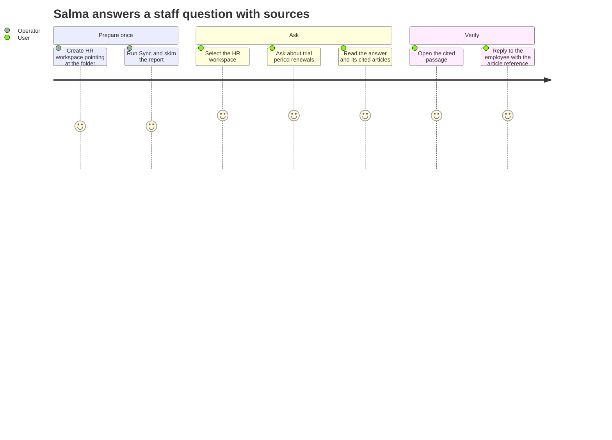
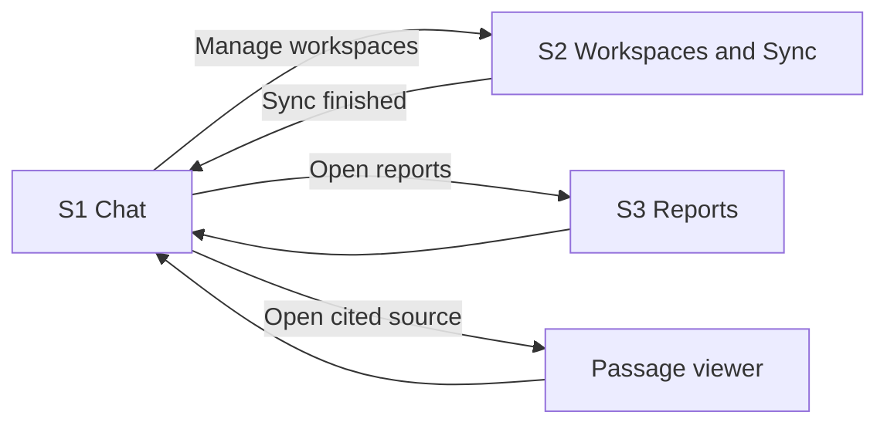

# Sanad: Product Requirements Document (PRD)

| Field | Value |
|---|---|
| Product (working title) | **Sanad** (Arabic: "backing, supporting document"). Rename freely; one line to change. |
| Document | Product Requirements Document, v1.0 |
| Date | 2026-07-20 |
| Status | Signed v1.0, approved 2026-07-20 |
| Prepared by | Discovery pass: Engagement Lead, Market Researcher, Product Manager, and UX Researcher roles, compressed into one artifact on the product owner's ruling |
| Approvers | Product Owner (build lead), Research & Quality Owner |
| Scope rule | This document is technology-free. Tools, components, data design, and hosting belong to the architecture package that follows it. |

**How to read this document.** Everything tagged [ASSUMPTION] or [SYNTHETIC] is honest guesswork awaiting field data; everything in the Evidence appendix was checked against a dated source. Priorities use a five-level scale: Highest, High, Medium, Low, Lowest.

---

## 1. Problem

An HR generalist at a 60-person company in Casablanca gets asked: "Can we extend this trial period a second time?" The answer exists. It sits somewhere inside Morocco's Labor Code (law 65-99), a text of 589 articles across 7 books, in force since 2004 and published as long PDF files (see Evidence appendix). Keyword search inside a PDF misses synonyms and context. Asking a generic chat assistant returns a fluent answer with no sources, and sometimes an invented one. Asking a lawyer costs money and a day of waiting.

The same pattern repeats far beyond HR. Any team that works from a folder of long documents (technical manuals, standards, internal guides) faces the same three bad options: slow manual search, unsourced machine answers, or an expensive expert.

[ASSUMPTION A1] Recurring document questions cost an HR generalist 1 to 3 hours per week. This number comes from reasoning, not field data; see Open risks (R1) for the validation plan.

## 2. Product summary

Sanad answers questions from the user's own documents and shows exactly where each answer came from. When the documents don't cover a question, it says so instead of inventing.

How it behaves:

1. The user creates a **workspace**: a named folder of documents on a machine they control (one workspace for HR and labor law, another for technical manuals, and so on).
2. Pressing **Sync** makes new and changed files in that folder questionable. One button, a per-file report, no background magic.
3. The user asks a question in plain language. The assistant searches the active workspace, **checks its own results**, retries with a reworded search when the first pass misses, and then writes an answer **with sources**: file name plus section label.
4. If nothing in the workspace covers the question, the assistant **refuses honestly**, states what it looked for, and suggests a next step.
5. A maintained **golden question set** scores every release for groundedness before it ships. Quality is a gate, never a hope.

### Positioning against today's alternatives

| Alternative | Speed | Trust (sources) | Knows your documents | Cost |
|---|---|---|---|---|
| Manual search in PDFs | Slow | Full (you read the text) | Yes | Your time |
| Generic chat assistant | Fast | None; can invent | No | Low |
| Asking an expert | Slow | High | Partly | High |
| **Sanad** | Fast | Every answer cited, refusals when uncovered | Yes, per workspace | Low |

## 3. Goals and success metrics

| ID | Goal | Metric and target | Measured by | Checked at |
|---|---|---|---|---|
| G1 | Trustworthy answers | ≥ 90% of golden-set answers fully grounded (every factual statement traceable to a cited passage) | Golden-set evaluation report (F-08) | Every release gate |
| G2 | Honest refusals | 20 of 20 out-of-scope golden questions get a clear "not covered" reply, zero invented answers | Same report | Every release gate |
| G3 | Visible sources | 100% of answers display at least one source reference | Report + screen inspection | Every release gate |
| G4 | Usable speed | Median answer ≤ 20 s, 95th percentile ≤ 60 s on the demo corpus and reference machine | Timed test run | QA phase |
| G5 | Fast content onboarding | A 200-page workspace becomes questionable ≤ 10 min after Sync on the reference machine | Timed test run | QA phase |
| G6 | Demo reliability | ≥ 9 of 10 consecutive scripted rehearsals complete without failure | Rehearsal log | Pre-defense |

## 4. Audience segments and personas

**Segments.**

- **Primary:** HR generalists and office managers at Moroccan SMEs (10 to 200 staff) who answer labor and contract questions as a side duty, without a legal department.
- **Secondary:** developers and students who work from large technical manuals and need precise, sourced answers.
- **Demo audience:** the examination jury, who will judge trust behaviors (sources, refusals, evaluation scores) as hard as features.

**Personas.** [SYNTHETIC] until interviews replace them (Open risk R1).

- **P1, Salma, 34, HR generalist, Casablanca.** Handles payroll, contracts, and "quick questions" for an 80-person services firm. Reads French comfortably. Wants an answer she can forward with the article number attached, because "trust me" doesn't survive a dispute.
- **P2, Yassine, 27, junior developer.** Lives inside long technical manuals. Wants fast lookups that quote the exact section, so he stops re-reading the same 40 pages.

## 5. Environment and project type

- **Type:** web application used in a desktop browser.
- **Where it runs:** a machine the operator controls (a laptop or a small internal server). Single organization, single site.
- **Maturity:** academic MVP built for a master's defense. Demo-grade availability; no paid support, no uptime promise.
- **Language:** interface copy in English for V1. The system must render French document content correctly (accents, ligatures) in V1. Arabic document content, and the full right-to-left reading experience, are V2 (F-14).
- **Data locality (binding constraint):** documents and everything derived from them stay on operator-controlled storage. Any external processing service used during answering must not retain document content beyond processing. The architecture phase implements this constraint and reports back how.

## 6. Users and permissions

V1 ships single-user: one person holds both roles on one machine. The role split still binds the design so V2 can add accounts without redesign.

| Role | Can | Cannot |
|---|---|---|
| **Operator** | Create, rename, delete workspaces; set the legal-content flag; run Sync; read sync reports; run evaluations; read evaluation reports and answer traces | Nothing reserved above them in V1 |
| **End user** | Pick the active workspace; ask questions; read answers and sources; open cited passages; start a new conversation | Manage workspaces; run Sync; run evaluations |

Logins, separate accounts, and permission enforcement across people are V2 (see Non-goals).

---

## 7. Feature inventory

MoSCoW lens: Highest and High together form the V1.0 must/should line. The recorded field is the five-level scale.

| ID | Feature | Release | Priority | One-line summary |
|---|---|---|---|---|
| F-01 | Workspaces | V1.0 | Highest | Named folders of documents, fully isolated from each other |
| F-02 | Sync on demand | V1.0 | Highest | One action ingests new and changed files, with a per-file report |
| F-03 | Sourced answers | V1.0 | Highest | Every answer cites file name and section label |
| F-04 | Self-check and retry | V1.0 | Highest | The system judges its own search results and retries reworded |
| F-05 | Honest refusal | V1.0 | Highest | "Not covered here" instead of an invented answer |
| F-06 | Clarifying questions | V1.0 | High | One clarifying question when the ask is ambiguous |
| F-07 | In-session conversation memory | V1.0 | High | Follow-ups like "and how many renewals?" resolve correctly |
| F-08 | Golden-set evaluation report | V1.0 | High | Scored quality report per release; releases are gated on it |
| F-09 | Legal-content disclaimer | V1.0 | High | Flagged workspaces show "informational only" on every answer |
| F-10 | Answer trace view | V1.1 | Medium | Per answer: searches run, files consulted, retries used |
| F-11 | Presentation-file ingestion | V1.1 | Medium | Slide decks become questionable, cited by slide number |
| F-12 | Automatic workspace routing | V1.1 | Medium | With no workspace selected, the system proposes the right one |
| F-13 | Live folder watching | V2 | Low | New files ingest without pressing Sync |
| F-14 | Arabic content and RTL reading | V2 | Low | Arabic documents render and cite correctly, right-to-left |
| F-15 | Answer feedback | V2 | Low | Thumbs and comment per answer, reviewable later |
| F-16 | Scanned-document text recovery | V2 | Lowest | Scanned PDFs gain a readable text layer |

### F-01 Workspaces (V1.0, Highest)

A workspace is a named folder of documents plus everything the system derives from it. One workspace is active per conversation. Isolation is absolute: an HR question never pulls passages from the technical manuals.

- Given two workspaces exist (HR, Manuals), when the user selects HR and asks a question, then every cited source belongs to an HR file.
- Given no workspace exists, when the app opens, then a guided empty state explains how to create one.
- Given a workspace is deleted after a confirmation warning, then its derived data is removed and the source files on disk stay untouched.

### F-02 Sync on demand (V1.0, Highest)

Sync scans the workspace folder, detects added, changed, and removed files, processes supported formats (PDF, DOCX, TXT, MD in V1), and reports per file. Unchanged files are skipped. One failing file never blocks the rest.

- Given three new PDF files in the folder, when Sync runs, then each is reported as Added with its page count, and its content is questionable afterward.
- Given a file already processed and unchanged, when Sync runs, then it is reported as Unchanged and is not reprocessed.
- Given a corrupted or password-protected file, when Sync runs, then it is reported as Failed with a plain-language reason, and every other file completes.
- Given a file was removed from the folder, when Sync runs, then it is reported as Removed and its passages stop appearing in answers.

### F-03 Sourced answers (V1.0, Highest)

The user asks in plain language. The answer is written only from passages found in the active workspace, and lists its sources: file name plus section label when the document provides one. The source line is the product's contract with the user.

- Given the HR workspace holds the Labor Code, when the user asks about the length of a trial period, then the answer cites at least one source and every factual statement is supported by the cited passages.
- Given any answered question, then at least one source reference is visible together with the answer.
- Given a displayed source, when the user opens it, then the matching passage is shown (see screen S1).

### F-04 Self-check and retry (V1.0, Highest)

Before answering, the system judges whether the passages it found actually address the question. Off-topic results trigger a reworded search. Default retry limit: 2, operator-configurable. This loop is the difference between a search box and an assistant that checks its own work.

- Given the first search returns passages judged off-topic, when the loop runs, then the question is reworded and searched again, and the retry count never exceeds the configured limit.
- Given retries are exhausted without relevant passages, then honest refusal (F-05) triggers.

### F-05 Honest refusal (V1.0, Highest)

When the workspace does not cover a question, the assistant says so, states what it looked for, and suggests a next step (rephrase, add documents, switch workspace). It never fills a gap with invented content.

- Given a question outside the corpus (a cooking question in the HR workspace), when asked, then the reply states that no answer was found in this workspace, lists the search attempts, and contains no fabricated facts.
- Given the 20 out-of-scope golden questions, when evaluated, then 20 of 20 produce refusals.

### F-06 Clarifying questions (V1.0, High)

- Given "tell me about that procedure" with no earlier context, when processed, then the assistant asks exactly one clarifying question instead of guessing.
- Given the user answers it, then the flow resumes with the clarified question.

### F-07 In-session conversation memory (V1.0, High)

- Given the user asked about trial periods, when they follow up with "and how many renewals?", then the assistant resolves the reference and answers about trial-period renewals.
- Given a new conversation is started, then no earlier context leaks in.

### F-08 Golden-set evaluation report (V1.0, High)

The flagship workspace ships with a maintained set of at least 40 questions with reference answers, plus 20 out-of-scope questions. Running the evaluation produces a dated report with groundedness and relevance, per question and overall. Releases are gated on it.

- Given the golden set, when the evaluation runs, then the report shows per-question and overall scores with the run date.
- Given overall groundedness under 90%, or any out-of-scope failure, when a release is proposed, then the release is blocked and the failing questions are listed.

### F-09 Legal-content disclaimer (V1.0, High)

- Given a workspace the operator flagged as legal content, when any answer renders in it, then a fixed line shows with the answer: informational only, not legal advice, consult a professional.
- Given a workspace without the flag, then the line does not show.

### F-10 Answer trace view (V1.1, Medium)

- Given an answered question, when the user opens its trace, then it lists the searches run, the files consulted, and the retries used for that answer.

### F-11 Presentation-file ingestion (V1.1, Medium)

- Given a slide deck in the workspace folder, when Sync runs, then slide text becomes questionable and citations name the file plus slide number.

### F-12 Automatic workspace routing (V1.1, Medium)

- Given no workspace is selected, when the user asks a clearly technical question, then the system proposes the workspace it judges most relevant and asks for confirmation before answering.

### F-13 Live folder watching (V2, Low)

- Given watching is enabled, when a new supported file lands in the folder and is fully written, then it is ingested exactly once without pressing Sync.

### F-14 Arabic content and RTL reading (V2, Low)

- Given an Arabic document is ingested, when one of its passages is cited, then the passage renders right-to-left with correct script and the surrounding screen mirrors properly.

### F-15 Answer feedback (V2, Low)

- Given an answer, when the user marks it down and comments, then the question-comment pair is stored and reviewable on the Reports screen.

### F-16 Scanned-document text recovery (V2, Lowest)

- Binding V1 behavior: given a scanned PDF without a readable text layer, when Sync runs, then the file is reported as Skipped with the reason stated. V2 recovers the text.

---

## 8. Pages and screens inventory

A shared shell wraps every screen: app name, active-workspace selector, and navigation between S1, S2, S3.

| ID | Screen | Release | Purpose |
|---|---|---|---|
| S1 | Chat | V1.0 | Ask questions, read sourced answers, open cited passages |
| S2 | Workspaces and Sync | V1.0 | Create and manage workspaces, run Sync, read sync reports |
| S3 | Reports | V1.0 | Run and read golden-set evaluation reports (V2 adds feedback review) |

### S1 Chat

- **Regions:** shell header; conversation area; collapsible source panel; input bar.
- **Components:** message list with four message variants (user, answer, refusal, clarification); source card (file name, section label, open-passage action); passage viewer; conditional disclaimer line (F-09); new-conversation action; a subtle indicator when retries happened.
- **Empty state:** no messages yet. Three sample questions fitting the active workspace, plus one line explaining that every answer carries sources.
- **Loading state:** working indicator with stage hints (searching, checking, writing). Input disabled with a visible reason.
- **Error state:** answering failed. Plain-language message, a retry action, and never a partial answer presented as final.
- **Accessibility:** WCAG 2.2 AA. Contrast ≥ 4.5:1, complete keyboard path (input, send, sources, passage viewer), visible focus, labels on all controls, status changes announced to assistive tech. RTL: layout mirrors correctly under a right-to-left locale; verified with an RTL preview even though V1 ships left-to-right.

### S2 Workspaces and Sync

- **Regions:** workspace list; workspace detail (folder path, legal-content flag, file table); Sync action with progress; last sync report.
- **Components:** create, rename, delete with confirmation; file table with columns name, type, size, status (Added, Changed, Unchanged, Failed, Removed, Skipped) and reason; progress with per-file ticks; last-sync timestamp.
- **Empty state:** no workspaces. Guided creation: name, folder path, optional legal flag.
- **Loading state:** Sync running. The list stays readable; a cancel action stops after the current file.
- **Error state:** folder missing or unreadable. Exact path shown plus a fix hint. A failed file never blocks the batch (F-02).
- **Accessibility:** AA as above; file table fully keyboard-navigable; progress announced; RTL mirroring noted.

### S3 Reports

- **Regions:** report list (date, workspace, overall scores); report detail (per-question table, pass or fail against thresholds); export action for the project report annex.
- **Empty state:** no reports yet, with a one-line pointer to run an evaluation.
- **Loading state:** evaluation running, with a question counter.
- **Error state:** run failed at question N; partial results kept and labeled partial.
- **Accessibility:** AA; score colors always paired with text labels, never color-only meaning; RTL mirroring noted.

## 9. User journey and screen flow

## 10. Performance targets

Numbers below are product targets. The architecture phase confirms feasibility early; if a target proves unreachable, it comes back as a change request against this document, with measurements attached.

| Target | Number | Condition | Validated in |
|---|---|---|---|
| Answer time | Median ≤ 20 s, 95th percentile ≤ 60 s | Demo corpus, reference machine (defined at test time) | QA phase |
| Content onboarding | 200-page workspace questionable ≤ 10 min after Sync | Same | QA phase |
| Workspace capacity, V1 | Up to 1,500 pages or 50 files per workspace; soft cap with a warning beyond | Same | QA phase |
| Concurrency, V1 | 1 active user, tested to 3 | Demo setting | QA phase |
| Groundedness | ≥ 90% on the golden set | Every release | Release gate |
| Out-of-scope refusals | 20 of 20 | Every release | Release gate |
| Rehearsal reliability | ≥ 9 of 10 scripted runs clean | Pre-defense | Defense prep |

## 11. Planning for failure

Message principle for every row: plain language, no jargon, never fake success, always name a next step.

| Failure | Product behavior |
|---|---|
| Unsupported file type in the folder | Skipped, listed in the sync report with the reason |
| Corrupted or password-protected file | Failed with reason; the rest of the batch completes |
| Scanned PDF without a text layer (V1) | Skipped with the reason stated (binding until F-16) |
| Empty workspace | Guided empty state; asking is disabled with an explanation |
| Workspace folder missing or unreadable | Exact path shown plus a fix hint; nothing partially ingested |
| Question not covered by the corpus | Honest refusal (F-05): what was searched, suggested next step |
| Nothing relevant after all retries | Same refusal path; retry count shown in the trace (F-10) |
| Answering service unreachable | Clear error and a retry action; no fabricated fallback answer |
| Answer interrupted mid-generation | Marked incomplete; user can retry; never shown as final |
| Workspace over the soft cap | Warning with the measured size and what to split |
| Second Sync triggered during a Sync | Blocked with a message; first run keeps going |
| Ambiguous question | One clarifying question (F-06), then normal flow |

Release-gate rule, restated: no version ships without a passing evaluation report (F-08 thresholds).

## 12. Versioning and release plan

| Release | Content | Gate |
|---|---|---|
| **V1.0 "Defense MVP"** | F-01 to F-09, screens S1 to S3 | G1, G2, G3 met; G4, G5 measured and reported |
| **V1.1 "Comfort"** | F-10, F-11, F-12 | Only if V1.0 passed its gate with calendar room left |
| **V2.0 "Reach"** | F-13 to F-16 | Beyond the project window; kept to show product direction |

Scope moves down (a V1.0 feature may drop to V1.1) but never up without a signed change to this document. Sprint dates and owners live in the project plan, a separate artifact.

## 13. Non-goals (V1.0 and V1.1)

- No legal advice. The product is informational; F-09 enforces the message.
- No accounts, logins, or per-person permissions.
- No answers from the open internet. The workspace corpus is the only knowledge source.
- No document editing or authoring.
- No mobile app. Desktop browser only.
- No learning from user data: past chats never change the system's behavior.
- No automated actions on other systems: nothing sent, nothing modified elsewhere.
- No hosted multi-company service.

## 14. Constraints

- **Team:** two people. One build owner; one research and quality owner. Architecture decisions and the issue journal are shared.
- **Calendar:** about four working weeks to the defense.
- **Budget:** near zero. Consumer hardware plus minimal service costs.
- **Data:** documents and derived data stay on operator-controlled storage; external processing must not retain content (handed to the architecture phase as a binding constraint).
- **Compliance:** the demo corpus is public material (official legal texts, public manuals). If real personal data ever enters a workspace, local data-protection obligations must be reviewed first (Open risk R3).

## 15. Viability verdict (compressed D2)

**GO, with one condition.** For: the flagship corpus is public, official, and free (Evidence appendix), and the product's trust behaviors (sources, refusals, gated evaluation) answer the documented weakness of unsourced assistants. Condition: the pain-frequency assumptions (A1, and personas P1, P2) rest on reasoning. Three short user interviews would upgrade them. Recommended before the final report; not blocking the build.

## 16. Open risks

| ID | Risk | Owner | Trigger | Mitigation |
|---|---|---|---|---|
| R1 | User pain unvalidated (A1, personas) | Research & Quality Owner | Before the final report | 3 interviews, 20 minutes each |
| R2 | Performance targets unproven | Architecture phase | First end-to-end test | Measure early; change-request this PRD with numbers if needed |
| R3 | Data-protection obligations unreviewed | Close-out | First non-public document in any workspace | Review before any real deployment |
| R4 | Single demo machine | Build owner | Defense day | Rehearsals per G6, plus a recorded fallback run |

## 17. Evidence and assumptions

**Verified findings** (accessed 2026-07-19 and 2026-07-20):

| Finding | Source | Published |
|---|---|---|
| Morocco's Labor Code (law 65-99) is publicly downloadable as a consolidated French PDF | "Code du travail, version consolidée", hosted by the Casablanca regional investment portal; also listed on the Abhatoo documentation portal (Ministry of Justice, Direction de la Législation) | Consolidation dated 2011 |
| The code counts 589 articles across 7 books and has applied since 2004 | "Code du travail au Maroc 2026: guide complet (loi 65-99)", ClicPaie | 2026 |
| An official-translation edition of the code is hosted by the International Labour Organization | "Le nouveau code de travail 2004", Bulletin Officiel translation edition, ILO document library | 2004 |
| A French/Arabic side-by-side edition circulates publicly | "Code du travail au Maroc, version synoptique", Deryany Law Office | 2025 |

**Assumptions:**

- A1 [ASSUMPTION]: HR generalists at SMEs lose 1 to 3 hours per week to recurring document questions. Validate via R1.
- A2 [ASSUMPTION]: users trust an answer more when the exact source passage is one click away. Validate during rehearsal usability checks.
- Personas P1 and P2 are [SYNTHETIC] until interviews replace them.

No market-size figure appears anywhere in this document, on purpose: none was verified, and an unverified number is worse than none.

## 18. Glossary

- **Workspace:** a named folder of documents plus everything the system derives from it.
- **Sync:** the on-demand action that makes new and changed files questionable.
- **Golden set:** the maintained list of test questions with reference answers, plus out-of-scope questions.
- **Groundedness:** the share of an answer's factual statements traceable to its cited passages.
- **Refusal:** the assistant's explicit "not covered here" reply, with the search attempts listed.
- **Source reference:** file name plus section label attached to an answer.
- **Out-of-scope question:** a golden-set question the corpus deliberately cannot answer.
- **Reference machine:** the fixed computer on which timing targets are measured and the defense runs.

## 19. Sign-off and change log

| Version | Date | Change | Author |
|---|---|---|---|
| 1.0 draft | 2026-07-20 | Initial full draft, compressed discovery pass | Discovery roles D1 to D4 |
| 1.0 | 2026-07-20 | Signed unchanged on product owner approval | Product Owner |

Approval: Product Owner ____________  Research & Quality Owner ____________

This PRD is technology-free by rule. Component, tooling, and data-design choices belong to the architecture package built on top of it.
