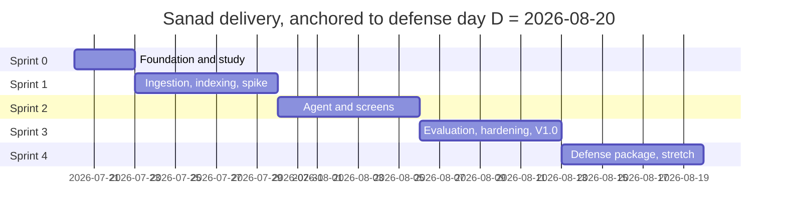

# Sanad: Project Plan (Scrum), v1.0

| Field | Value |
|---|---|
| Document | Project Plan, v1.1 |
| Date | 2026-07-20 |
| Status | Signed v1.1, amended 2026-07-20 by CR-01 (thin API layer) |
| Binding inputs | Sanad PRD v1.0 (signed), Architecture v1.0 (signed), S1-S4 hand-off packet |
| Team | **YL** (build owner), **MB** (research & quality owner), **BOTH** (shared) |
| Anchor | Defense day D assumed 2026-08-20. Sprint 4 ends at D-1. If D moves, shift every date; the structure holds. |

**How to read this document.** Epics carry a phase owner in the header. Every story carries: id, owner, priority on the five-level scale (Highest, High, Medium, Low, Lowest), points, acceptance criteria. One point is 2 to 3 focused hours for its owner, assuming the AI-assisted build workflow on code stories; the sprint-1 review recalibrates this. Branch names follow the architecture rule, example: `feat/S1-ST-17-sync-engine`.

## 1. Working agreement (two-person scrum)

**Ceremonies.**
- Daily sync, 10 minutes (BOTH): yesterday, today, blockers. Blockers older than one day get a journal entry and a decision.
- Sprint planning, Monday, 30 minutes (BOTH): pull stories from Ready into the sprint, confirm owners and points.
- Sprint review, Friday, 20 minutes (BOTH): demo only what is Done, against acceptance criteria.
- Retro, Friday, 10 minutes (BOTH): one keep, one drop, one try. Logged in the journal.

**Board.** GitHub Projects on the `sanad` repo. Columns: Backlog, Ready, In progress, In review, Done. WIP limit: 2 items per person. The board is the single truth; if it is not on the board, it is not happening.

**Definition of Ready.** A story enters Ready only with: acceptance criteria written, owner set, points set, and its PRD or architecture reference named.

**Definition of Done.** All of: acceptance criteria pass; tests green locally and in CI; partner review approved (code mechanics by YL, behavior against acceptance criteria by MB, per architecture 12.2); `docs/journal.md` updated if a problem was met and solved; no secrets or `data/` files in the diff; **the story's owner can explain the change out loud in one minute without notes.** That last item is the defense insurance: code nobody can explain does not merge, whatever wrote it.

**Change control.** Scope moves down, never up, without a signed PRD change (PRD section 12). New ideas go to the Backlog as V2 candidates, not into the sprint.

## 2. Timeline

Checkpoints C1, C2, C3 sit at the ends of sprints 1, 2, 3 (section 8).

## 3. Releases

| Release | Content | Exit rule | Target |
|---|---|---|---|
| Sprint-0 baseline | Repo, CI, Docker, study day, corpus v1 | All sprint-0 Highest stories Done | 2026-07-22 |
| **V1.0 "Defense MVP"** | Features F-01 to F-09, screens S1-S3, gate green | Evaluation gate passes (G1-G3), G4/G5 measured, tag `v1.0.0` | 2026-08-12 |
| **V1.1 "Comfort" (stretch)** | F-10, F-11, F-12 | Only if every Highest story is Done by 2026-08-15; tag `v1.1.0` | 2026-08-17 |
| V2.0 | Backlog only (F-13 to F-16) | Out of the project window by design | none |

## 3.1 Epic index

| Epic | Name | Phase owner | Sprint(s) | Release |
|---|---|---|---|---|
| E1 | Foundation and study | YL, with MB onboarding stories | 0 | Sprint-0 baseline |
| E2 | Ingestion and indexing | YL | 1 | V1.0 |
| E3 | Agent and chat | YL | 2 | V1.0 |
| E4 | Workspaces screen | YL | 2 | V1.0 |
| E5 | Evaluation and reports | YL (build), MB (golden set) | 3 | V1.0 |
| E6 | Hardening and measurements | MB (manual QA), YL (fixes) | 3 | V1.0 |
| E7 | Defense package | MB (materials), YL (demo) | 4 | Report and defense |
| E8 | Comfort stretch, F-10 to F-12 | YL | 4, conditional | V1.1 |

MB also runs one continuous stream across sprints 1-4: golden-set authoring and report chapters. It never blocks the build line, and the build line never blocks it.

## 4. Sprint 0 (Jul 20-22): Epic E1, Foundation and study. Phase owner: YL, with MB onboarding stories.

| ID | Story | Own | Prio | Pts | Acceptance criteria |
|---|---|---|---|---|---|
| ST-01 | Create private repo `sanad`, add MB as collaborator, both machines clone | YL | Highest | 1 | Both machines push a test commit to a branch; MB's push succeeds |
| ST-02 | Project skeleton: `pyproject.toml`, uv lockfile, `config.py`, `.env.example` | YL | Highest | 2 | `uv sync` green on both machines; every config variable documented in `.env.example` |
| ST-03 | CI skeleton `ci.yml`: ruff + pytest on every PR | YL | Highest | 2 | A deliberately failing test blocks a PR; fixing it unblocks |
| ST-04 | Branch protection on `main` + PR template (human click, per architecture) | YL | Highest | 1 | Direct push to main rejected; template shows the 5-point checklist from architecture 12.2 |
| ST-05 | Dockerfile + compose with `data/` volume | YL | High | 2 | `docker compose up` serves a UI stub in the browser |
| ST-06 | Structured study day: LangGraph tutorial + reference repo walkthrough, 10 written takeaways each | BOTH | Highest | 3 | Two journal entries exist; MB explains the sync flow and the agent loop in her own words; YL explains parent/child retrieval trade-off |
| ST-07 | Corpus v1: labor code PDF + 2 HR/CNSS guides collected and checked; workspace-2 manuals picked | MB | Highest | 2 | Files open, French text is selectable (not scanned images), source and date logged per file |
| ST-08 | Project board created, all stories imported, owners and WIP limits set | MB | High | 1 | Every story in this plan visible on the board with owner and priority |
| ST-09 | Journal and rehearsal-log templates committed in `docs/` | MB | High | 1 | `journal.md` and `rehearsal_log.md` exist with field headers, first entry written |

## 5. Sprint 1 (Jul 23-29): Epic E2, Ingestion and indexing. Phase owner: YL. Parallel MB stream: evaluation prep.

| ID | Story | Own | Prio | Pts | Acceptance criteria |
|---|---|---|---|---|---|
| ST-10 | SQLite schema + data access with `PRAGMA foreign_keys`, cascade tested | YL | Highest | 3 | Unit tests: cascade delete, all six statuses, unique file-per-workspace |
| ST-11 | Workspaces create/rename/delete + legal flag (module level) | YL | Highest | 2 | PRD F-01 criteria pass at module level, including derived-data-only delete |
| ST-12 | Content hashing + change-detection state machine | YL | Highest | 3 | Transitions new/changed/unchanged/removed unit-tested, including hash collision guard by size+hash |
| ST-13 | Conversion ladder: PDF, DOCX, TXT, MD; Skipped and Failed reasons | YL | Highest | 3 | Fixture corpus converts; corrupted file reports Failed; scanned PDF reports Skipped with reason |
| ST-14 | Parent/child chunking per architecture 7.5 | YL | Highest | 2 | Boundary tests at 2,000 and 4,000 characters; 100-char overlap verified |
| ST-15 | Embeddings module with mandatory `passage:`/`query:` prefixes + the prefix unit test | YL | Highest | 2 | Test fails if any embedded text lacks its prefix; model downloads once and caches |
| ST-16 | Vector store (per-workspace collections) + parent JSON store | YL | Highest | 3 | Isolation test: HR query never returns manuals chunks; parents resolve by id |
| ST-17 | Sync engine end to end + per-file report rows | YL | Highest | 3 | PRD F-02 criteria pass on the fixture corpus; six statuses appear correctly; double-sync blocked |
| ST-18 | SPIKE: index the labor corpus, measure G5 time and 20-question retrieval latency, write the OR-1 verdict | YL | Highest | 2 | Numbers in the journal against G4/G5 targets; verdict: on-track, tune, or change-request |
| ST-19 | Golden set batch 1: 15 in-scope + 8 out-of-scope French questions with reference answers and article references | MB | Highest | 3 | Files in `evaluation/golden/`, schema respected, PR reviewed by YL |
| ST-20 | Manual QA checklist drafted from the PRD failure table and screen states | MB | High | 2 | One checklist file covering all 12 failure rows and all S1-S3 states |

**Checkpoint C1 (Jul 29):** spike verdict written, sprint-1 velocity measured. Under 80% of planned points done, or spike verdict negative: apply section 8 before planning sprint 2.

## 6. Sprint 2 (Jul 30-Aug 5): Epics E3 Agent and chat + E4 Workspaces screen. Phase owner: YL. Parallel MB stream: golden set and report.

| ID | Story | Own | Prio | Pts | Acceptance criteria |
|---|---|---|---|---|---|
| ST-21 | Agent graph skeleton + trace collector wired | YL | Highest | 3 | Graph runs end to end on a stub; every answer object carries its trace |
| ST-22 | Rewrite-and-split node + clarification path (F-06) | YL | High | 2 | Ambiguous fixture question triggers exactly one clarifying question; answer resumes after reply |
| ST-23 | Hybrid retrieval + relevance grader + reword retry with ceiling (F-04) | YL | Highest | 3 | Retry count never exceeds config; off-topic fixture triggers exactly one reword cycle |
| ST-24 | Answer node with source contract + honest refusal node (F-03, F-05) | YL | Highest | 3 | PRD F-03 and F-05 criteria pass on fixtures; an answer without sources cannot render as final |
| ST-25 | Session memory summary node (F-07) | YL | High | 2 | Follow-up reference resolves; new conversation starts clean |
| ST-26 | Legal disclaimer wiring (F-09) | YL | High | 1 | Flagged workspace shows the line on every answer; unflagged shows none |
| ST-27 | Chat screen S1: message variants, source cards, passage viewer, empty/loading/error states | YL | Highest | 3 | Every S1 state from PRD section 8 demonstrated live |
| ST-28 | Workspaces screen S2: list, detail, sync progress, report table, double-sync block | YL | Highest | 3 | Every S2 state demonstrated; failed file never blocks the batch in the UI |
| ST-51 | CR-01 thin API: FastAPI host, /api/v1 endpoints delegating to services, Gradio mounted at /, live /docs | YL | High | 3 | Every endpoint in `docs/api/openapi.yaml` responds on 127.0.0.1; the UI works unchanged when mounted; /docs renders the schema |
| ST-29 | Golden set batch 2: +15 in-scope, +7 out-of-scope | MB | Highest | 3 | Running totals 30+15; same schema and review path |
| ST-30 | Demo script v0 (10 steps), used in MB's behavioral PR reviews from now on | MB | High | 1 | Script committed; one PR review comment references a script step |
| ST-31 | Report skeleton + chapters 1-2 drafted (problem, market and PRD summary) | MB | High | 2 | Chapters draft in `docs/`, sourced from the signed PRD, assumptions still tagged |

CR-01 adds 3 points to YL's sprint-2 load. If checkpoint C1 reads velocity under plan, ST-51 is the first story to slide into sprint 3, ahead of any descope-ladder step.

**Checkpoint C2 (Aug 5):** the walking skeleton must answer a real labor-law question with sources, end to end, on YL's machine. If not, section 8 applies before sprint 3.

## 7. Sprint 3 (Aug 6-12): Epics E5 Evaluation and reports + E6 Hardening. Phase owners: YL (build), MB (golden set and manual QA). Ends with the V1.0 gate.

| ID | Story | Own | Prio | Pts | Acceptance criteria |
|---|---|---|---|---|---|
| ST-32 | Evaluation runner: faithfulness + relevancy per question, refusal checker on out-of-scope set | YL | Highest | 3 | One command produces a dated report with per-question and overall scores |
| ST-33 | Gate script with PRD thresholds + `eval.yml` manual-dispatch workflow using the repo secret | YL | Highest | 2 | Gate exits non-zero on any threshold miss and lists failing questions; dispatch is manual only |
| ST-34 | Reports screen S3: list, detail, thresholds pass/fail, export | YL | High | 2 | Every S3 state from PRD section 8 demonstrated; export lands a file usable in the report annex |
| ST-52 | CR-01 contract tests: drift check (served schema equals committed contract) + happy and error paths with the fake model | YL | High | 2 | CI fails on schema drift; 404, 409, and 503 paths of ask and sync-job endpoints asserted |
| ST-35 | Golden set complete and frozen: 40 in-scope + 20 out-of-scope, v1 tag on the folder | MB | Highest | 2 | Counts verified; freeze notice in the journal; later edits need a new version |
| ST-36 | First full evaluation run + one tuning iteration | BOTH | Highest | 3 | Report exists; every failing question triaged (YL turns knobs, MB judges answers); second run recorded |
| ST-37 | G4 latency measurement + tuning against targets | YL | Highest | 2 | 20 timed questions on the reference machine; numbers vs G4 in the journal |
| ST-38 | Manual QA execution: 12 failure rows walked, all screen states, keyboard-only pass, contrast check, RTL preview | MB | Highest | 3 | Checklist signed with dates; every defect filed as an issue with severity |
| ST-39 | Bugfix buffer (explicit capacity for whatever ST-36 and ST-38 surface) | YL | Highest | 3 | Sev1 and sev2 issues closed or descoped by C3 with a written ruling |
| ST-40 | Report chapters 3-4 drafted (architecture summary, method and scrum) | MB | High | 2 | Chapters draft in `docs/`, sourced from the signed architecture and this plan |
| ST-41 | V1.0 release: gate green, tag `v1.0.0`, code freeze on V1.0 scope | YL | Highest | 1 | Gate exit code 0 on the frozen golden set; annotated tag pushed |

**Checkpoint C3 (Aug 12):** gate green and tag pushed, or section 8 executes and the defense story becomes "V1.0 minus the recorded cuts", which is a defensible story only if the cuts are documented change requests.

## 8. Sprint 4 (Aug 13-19): Epic E7, Defense package. Phase owners: MB (materials), YL (demo). Stretch epic E8 only behind the Aug 15 condition.

| ID | Story | Own | Prio | Pts | Acceptance criteria |
|---|---|---|---|---|---|
| ST-42 | Report chapters 5-6: results with eval numbers, issue journal digest, limits and future work (V2 backlog) | MB | Highest | 3 | Numbers match the frozen eval report; every limit maps to a PRD non-goal or an open risk |
| ST-43 | Slide deck: story arc by MB, technical figures by YL, both diagrams re-used from signed docs | BOTH | Highest | 2 | Deck covers problem, solution, architecture, method, results, demo, limits; 15 minutes dry-run fits |
| ST-44 | Demo script final + one full offline rehearsal in strict-local mode | YL | Highest | 2 | Script v1 committed; offline run completes on the reference machine with network disabled |
| ST-45 | Rehearsal protocol: 10 scripted runs logged, 1 clean run screen-recorded as fallback | BOTH | Highest | 2 | G6 met (9 of 10 clean); recording stored off the demo machine |
| ST-46 | Q&A drill: 30 likely jury questions with owned answers (MB: product, method, eval meaning; YL: architecture, code, trade-offs) | BOTH | Highest | 2 | Each question has an owner and a one-minute answer; one mock defense held |
| ST-47 | STRETCH F-10 answer trace view | YL | Medium | 2 | PRD F-10 criterion passes; only starts if every Highest story is Done by Aug 15 |
| ST-48 | STRETCH F-11 PPTX ingestion | YL | Medium | 2 | PRD F-11 criterion passes; same start condition |
| ST-49 | STRETCH F-12 workspace routing proposal | YL | Medium | 2 | PRD F-12 criterion passes; same start condition |
| ST-50 | User interviews (risk R1): 3 interviews, 20 minutes, notes anonymized, assumptions A1 and personas updated or confirmed | MB | Medium | 2 | Anonymized notes in `docs/`; PRD assumption tags updated in the report, not in the signed PRD |

## 9. Planning for failure

### 9.1 Checkpoint rules

| Checkpoint | Date | Question | If the answer is no |
|---|---|---|---|
| C1 | Jul 29 | Spike verdict acceptable and velocity >= 80% of plan? | Recalibrate points, apply descope ladder step 1, re-plan sprint 2 |
| C2 | Aug 5 | End-to-end sourced answer on a real question? | Descope ladder steps 1-2, sprint 3 absorbs the slip, V1.1 dies |
| C3 | Aug 12 | Evaluation gate green? | Ladder steps 3-4 with written change requests; defense narrative shifts to documented cuts |

### 9.2 Descope ladder (pre-agreed order, no debate under pressure)

1. Drop the stretch stories ST-47 to ST-49. No PRD change needed.
2. Drop ST-50 interviews. Risk R1 stays open and is named in the report.
3. Shrink the API (CR-01): ST-52 drops first, then ST-51 narrows to the ask and sync-job endpoints only, then full deferral to V1.1. Each stage is a recorded change request against architecture v1.1.
4. Golden set reduced to 30 in-scope + 15 out-of-scope. Requires a PRD change request against F-08; thresholds stay untouched.
5. Simplify F-07 to a last-3-turns window and F-06 to a fixed rephrase prompt. Requires a PRD change request; features remain present, thinner.
6. **Never cut:** F-03 sources, F-05 refusals, F-08 gate, F-09 disclaimer. That set is the product's identity and the defense's spine. If these are threatened, the conversation is about the defense date, not the scope.

### 9.3 Project risk register (adds to the four architecture risks)

| Risk | Owner | Trigger | Response |
|---|---|---|---|
| Sick day or blocked day | BOTH | Any day lost | WIP limit keeps work resumable; buffer story ST-39 absorbs one lost day per sprint |
| Model API credits run out | YL | Credit alert at 50% and 80% | Strict-local mode for development; cloud key reserved for evaluation runs and rehearsals |
| Laptop failure | YL | Hardware event | Repo is remote; `data/` is derivable by re-running Sync; corpus copy in shared cloud storage from ST-07; Docker image rebuilds the environment on any machine |
| Merge conflicts pile up | YL | Two branches touch one module | One story, one branch, merged within 2 days; daily sync assigns modules to one owner at a time |
| Code the owner cannot explain | BOTH | Any PR review | Definition of Done blocks the merge; the story returns to In progress until the one-minute explanation works |
| Scope creep | BOTH | Any new idea mid-sprint | Straight to Backlog as V2 candidate; change control rule from section 1 |

## 10. Sign-off and change log

| Version | Date | Change | Author |
|---|---|---|---|
| 1.0 draft | 2026-07-20 | Initial full plan, sprints 0-4, 50 stories | Project planning pass |
| 1.0 | 2026-07-20 | Signed unchanged on team approval | YL, MB |
| 1.1 | 2026-07-20 | CR-01 applied: ST-51 (sprint 2), ST-52 (sprint 3), ladder step 3 added, capacity note | Human ruling, option 2 |

Approval: Product Owner (YL) ____________  Research & Quality Owner (MB) ____________
