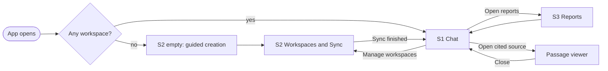
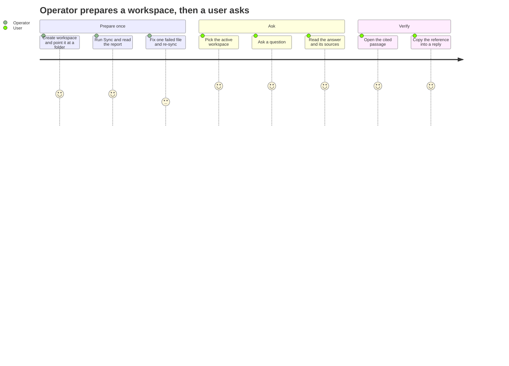

# Sanad: UX Specification

| Field | Value |
|---|---|
| Artifact id | UX-01 |
| Version | v1.0 |
| Date | 2026-07-28 |
| Stage | D4 UX Researcher |
| Status | Draft, awaiting sign-off |
| Binding inputs | Sanad PRD v1.0 (sections 6, 8, 9, 11), Sanad Architecture v1.0/v1.1 |
| Companion | CR-02 against ADR-02. This spec names no technology. The stack lives in the Architecture ADR. |

## 1. What this adds

PRD section 8 already fixes the screen inventory, the regions of each screen, and the requirement that every screen carry an empty, a loading, and an error state. That stays binding. Nothing here overrides it.

This spec adds the four things section 8 does not carry, because the PRD was written when the interface was going to be a framework's default look:

1. A visual system: layout grid, type scale, colour roles, spacing, density.
2. A reusable component inventory, so three screens do not grow three versions of the same file table.
3. Interaction detail per state, including what is focusable, what is disabled, and what gets announced.
4. A coverage matrix mapping all twelve PRD section 11 failure rows to the screen and treatment that handles each one.

Where this spec and PRD section 8 overlap, section 8 governs scope. This governs depth.

## 2. Design principles

**Sources are the product, not a footnote.** Every answer carries its evidence in the same visual weight as the prose. A source card is never collapsed by default, never smaller than body text, never grey-on-grey.

**A refusal is a first-class answer.** The interface has a real design for "I could not find this", equal in polish to a successful answer. If refusals look like errors, users learn to distrust the honest path, which is the behaviour the product exists to demonstrate.

**Never fake progress.** Stage hints during a long operation say what is actually happening. A spinner with no stage is banned. A partial answer is never styled as complete.

**Density over decoration.** The primary users read documents all day. Tables stay tight, line length caps at a readable measure, and whitespace does work rather than filling space.

## 3. Visual system

### 3.1 Layout

Single fixed shell, content constrained to a readable measure. Desktop browser only, per PRD section 5.

| Token | Value | Use |
|---|---|---|
| `shell-max` | 1280px | Outer content cap |
| `prose-max` | 68ch | Answer text, refusals, any paragraph |
| `gutter` | 24px | Page edge padding |
| `rail` | 320px | Source panel, workspace list |

Breakpoint at 1024px: the source panel moves from a side rail to a stacked section below the answer. Below 768px the app shows a plain notice that Sanad targets a desktop browser. Do not build a phone layout.

### 3.2 Spacing scale

4, 8, 12, 16, 24, 32, 48, 64. Nothing between. A value not on this scale is a bug.

### 3.3 Type scale

One humanist sans for the interface, one monospace for file names, paths, and section labels. Monospace matters: file names and article numbers get compared character by character, and a proportional font makes that harder.

| Role | Size | Weight | Line height |
|---|---|---|---|
| Display | 28px | 600 | 1.25 |
| Section | 20px | 600 | 1.3 |
| Body | 15px | 400 | 1.6 |
| Body strong | 15px | 600 | 1.6 |
| Meta | 13px | 400 | 1.45 |
| Mono | 13px | 400 | 1.5 |

Body sits at 15px rather than 16px because the file tables carry a lot of columns. Anything below 13px is banned.

### 3.4 Colour roles

Roles, not brand. Swap the hex values, keep the roles and the contrast ratios.

Every ratio below was computed, not estimated. Light values are measured against `surface` light, dark values against `surface` dark.

| Role | Light | Dark | Light ratio | Dark ratio | Floor |
|---|---|---|---|---|---|
| `surface` | `#FFFFFF` | `#14161A` | base | base | none |
| `surface-raised` | `#F6F7F9` | `#1C1F25` | base | base | none |
| `border` | `#DFE3E8` | `#2C313A` | 1.29 | 1.39 | none, decorative only |
| `border-strong` | `#6E7681` | `#6E7681` | 4.59 | 3.94 | 3:1 |
| `text` | `#16191D` | `#E8EAED` | 17.63 | 15.03 | 4.5:1 |
| `text-muted` | `#5A626D` | `#9AA2AE` | 6.17 | 7.03 | 4.5:1 |
| `accent` | `#1F5F8B` | `#5AA9DC` | 6.84 | 7.02 | 4.5:1 |
| `focus` | `#0B7285` | `#3BC9DB` | 5.59 | 9.11 | 3:1 |

Two border roles, and the split matters. `border` is decorative: dividers, table rules, card edges that merely group content. WCAG sets no ratio for those, and forcing 3:1 on every divider produces a harsh, cluttered interface. `border-strong` carries the 3:1 floor and is required wherever a border is the only thing identifying a control boundary or its state: input fields, the file table's focused row, toggle outlines, the selected workspace. Getting this backwards is the usual way an interface fails 1.4.11 while looking fine.

`border-strong` uses one value in both themes because `#6E7681` clears 3:1 against white and against the dark surface.

Both themes ship. The interface follows the operating system preference and offers an explicit toggle, because a defense room projector is unpredictable and you want that switch on stage.

### 3.5 Status colours

The six sync statuses and the pass/fail scores never rely on colour alone. Every status renders as a coloured dot plus a text label, and the text label is the accessible name.

| Status | Role | Shape cue |
|---|---|---|
| Added | positive | filled circle |
| Changed | notice | half circle |
| Unchanged | neutral | hollow circle |
| Failed | danger | filled square |
| Removed | neutral-strong | dash |
| Skipped | warning | hollow square |

Shape plus label plus colour. Any one of the three can be removed and the table still reads.

### 3.6 Motion

Transitions cap at 150ms. Progress and stage hints animate. Nothing else moves. Honour reduced-motion by disabling all transitions and replacing any animated indicator with a static one plus text.

## 4. Shared shell

Present on every screen, per PRD section 8.

**Regions.** Header bar with product name; active-workspace selector; primary navigation between S1, S2, S3; theme toggle.

**The workspace selector is the most important control in the product.** Workspace isolation is F-01's whole promise, so the active workspace stays visible at all times, never inside a menu. It shows the workspace name and, when the legal flag is set, a small persistent marker. Changing it clears nothing and interrupts nothing, but the chat area shows a one-line notice that the conversation context has moved.

**Empty state.** No workspaces exist. The selector renders disabled with the label "No workspace yet", navigation to S1 is disabled with a tooltip explaining why, and S2 is the landing screen.

**Keyboard.** Tab order runs product name, workspace selector, nav items in visual order, theme toggle, then into the screen. A skip-to-content link is the first focusable element on the page.

## 5. Component inventory

Build once, use across screens.

| Component | Used by | Notes |
|---|---|---|
| `WorkspaceSelector` | shell | name, legal marker, disabled empty variant |
| `SourceCard` | S1 | file name (mono), section label, open-passage action |
| `PassageViewer` | S1 | overlay, cited span highlighted, close returns focus to the invoking card |
| `MessageBubble` | S1 | four variants: user, answer, refusal, clarification |
| `DisclaimerLine` | S1 | conditional on the workspace legal flag |
| `StatusPill` | S2, S3 | dot plus shape plus label, six sync values plus pass/fail |
| `FileTable` | S2 | name, type, size, status, reason; sortable; keyboard navigable |
| `ProgressBar` | S2, S3 | determinate with a counter, plus a stage hint line |
| `ConfirmDialog` | S2 | destructive actions only, types-to-confirm not required, focus trapped |
| `EmptyState` | all | icon, one-line explanation, primary action |
| `ErrorPanel` | all | plain message, the exact failing value, a fix hint, a retry action |
| `ScoreRow` | S3 | metric name, value, threshold, pass or fail |

`ErrorPanel` always shows the offending value. A missing folder shows the path. A failed file shows the file name. An unreachable service shows what was attempted. Never a bare "something went wrong".

## 6. S1 Chat

Ask questions, read sourced answers, open cited passages.

### 6.1 Regions

Shell header. Conversation area capped at `prose-max`. Source panel on the right rail, stacking below the answer under 1024px. Input bar pinned to the bottom of the conversation area.

### 6.2 Components and behaviour

Four message variants, visually distinct:

- **User.** Right-aligned in LTR, `surface-raised`, no source panel.
- **Answer.** Left-aligned, `surface`, with its source cards attached and visible. A subtle inline marker appears when retries happened, showing the count on hover and on focus.
- **Refusal.** Left-aligned, bordered in `notice` rather than `danger`. States what was searched and suggests a next step. It is styled as a legitimate outcome, not a failure.
- **Clarification.** Left-aligned, carries exactly one question and, where the system can offer them, two or three concrete choices as buttons.

The disclaimer line renders directly under the answer body, above the source cards, only when the active workspace carries the legal flag.

New-conversation action sits in the conversation area header, not the shell, because it is scoped to S1.

### 6.3 States

**Empty.** No messages. Three sample questions drawn from the active workspace, each one clickable to populate the input. One line stating that every answer carries its sources. If the workspace has no documents, the sample questions are replaced by a pointer to S2 and the input is disabled with the reason shown inline.

**Loading.** Stage hints replace a bare spinner: "Searching the workspace", then "Checking the answer", then "Writing". The input is disabled and shows why. A cancel action is available and stops after the current stage.

**Error.** `ErrorPanel` with a retry action. A partial answer is never presented as final. If generation was interrupted, the partial text stays visible but is explicitly marked incomplete and cannot be copied as if it were an answer.

### 6.4 Accessibility

WCAG 2.2 AA. Complete keyboard path across input, send, each source card, the passage viewer, and back. Visible focus ring at 3:1 against its background, never removed. New messages are announced through a polite live region. Stage changes during loading are announced. The passage viewer traps focus while open and returns focus to the card that opened it. Every control carries a label; icon-only buttons carry an accessible name.

### 6.5 RTL

Message alignment mirrors. The source rail moves to the left. Mono file names and article numbers stay left-to-right inside a mirrored layout, which is the case most implementations get wrong. Verify with an RTL preview even though V1 ships LTR, per PRD section 5.

## 7. S2 Workspaces and Sync

Create and manage workspaces, run Sync, read reports.

### 7.1 Regions

Workspace list on the left rail. Workspace detail as the main region, holding folder path, legal flag, and the file table. Sync action with progress. Last sync report below.

### 7.2 Components and behaviour

Create, rename and delete. Delete uses `ConfirmDialog` and states plainly that derived data goes and the source files on disk stay, because that is F-01's third criterion and users will not believe it unless the dialog says so.

The legal flag is a labelled toggle with a one-line explanation of what it does, which is add a disclaimer to answers. It does not block deletion or restrict access, and the label must not imply that it does.

File table columns: name (mono), type, size, status, reason. Reason is empty for Added, Changed and Unchanged, and carries text for Failed, Skipped and Removed.

Sync progress is determinate with a per-file counter and a stage hint. A cancel action stops after the current file, never mid-file.

### 7.3 States

**Empty.** No workspaces. Guided creation with three fields: name, folder path, optional legal flag. This is the app's first-run screen and the only entry point when nothing exists.

**Loading.** Sync running. The workspace list stays readable and navigable. The Sync action is replaced by progress plus cancel. A second Sync attempt is blocked with a message stating the first run continues.

**Error.** Folder missing or unreadable shows the exact path plus a fix hint, and nothing is partially ingested. A workspace over the soft cap shows a warning carrying the measured size and what to split. Individual file failures appear as rows in the table and never stop the batch.

### 7.4 Accessibility

WCAG 2.2 AA. The file table is fully keyboard navigable by row and by cell, with sortable headers reachable and their sort state announced. Progress is announced at meaningful intervals rather than on every tick. The confirm dialog traps focus and returns it to the trigger. Status is never conveyed by colour alone.

### 7.5 RTL

List rail moves right. Table column order mirrors, but file paths and sizes stay left-to-right. Progress fills right to left.

## 8. S3 Reports

Run and read golden-set evaluation reports.

### 8.1 Regions

Report list showing date, workspace, and overall scores. Report detail with a per-question table and pass or fail against thresholds. Export action for the project report annex.

### 8.2 Components and behaviour

`ScoreRow` shows metric, value, threshold, and outcome. The threshold is always visible next to the value, because a score without its threshold means nothing to a jury.

Export produces a file suitable for the written report annex. The action states what it produces before it runs.

### 8.3 States

**Empty.** No reports yet, with one line pointing to how to run an evaluation.

**Loading.** Evaluation running with a question counter, "question 12 of 45". This one is long, so the counter is required, not optional.

**Error.** The run failed at question N. Partial results are kept and labelled partial, both in the list and in the detail. A partial report can never be exported without the label travelling with it.

### 8.4 Accessibility

WCAG 2.2 AA. Score colours always pair with a text label, never colour alone. The per-question table is keyboard navigable. The question counter is announced periodically, not on every increment.

### 8.5 RTL

Table mirrors. Numbers and thresholds stay left-to-right.

## 9. Screen flow

## 10. User journey

## 11. Failure coverage

All twelve PRD section 11 rows, mapped to where they surface.

| Failure | Screen | Treatment |
|---|---|---|
| Unsupported file type | S2 | Table row, status Skipped, reason names the type |
| Corrupted or password-protected file | S2 | Table row, status Failed, reason given, batch continues |
| Scanned PDF without a text layer | S2 | Table row, status Skipped, reason names the missing text layer |
| Empty workspace | S1 | Empty state points to S2, input disabled with the reason inline |
| Folder missing or unreadable | S2 | `ErrorPanel` with the exact path and a fix hint, nothing ingested |
| Question not covered | S1 | Refusal variant stating what was searched plus a next step |
| Nothing relevant after retries | S1 | Same refusal variant, retry count on the inline marker |
| Answering service unreachable | S1 | `ErrorPanel` with retry, no fabricated fallback |
| Answer interrupted mid-generation | S1 | Partial text kept, marked incomplete, retry offered |
| Workspace over the soft cap | S2 | Warning with measured size and what to split |
| Second Sync during a Sync | S2 | Sync action blocked with a message, first run continues |
| Ambiguous question | S1 | Clarification variant, exactly one question |

## 12. Acceptance criteria

Given-When-Then, testable, per the PRD spine.

1. Given no workspace exists, when the app opens, then S2 is the landing screen, the guided creation form is visible, and navigation to S1 is disabled with a stated reason.
2. Given a workspace carries the legal flag, when any answer renders, then the disclaimer line appears between the answer body and its source cards.
3. Given a workspace does not carry the legal flag, when any answer renders, then no disclaimer line appears anywhere.
4. Given an answer has rendered, when the user activates a source card by keyboard alone, then the passage viewer opens, focus moves into it, and closing it returns focus to that same card.
5. Given a Sync is running, when a second Sync is triggered, then it is blocked with a message and the first run continues to completion.
6. Given a file fails during Sync, when the run finishes, then that file appears with status Failed and a reason, and every other file in the batch has been processed.
7. Given the workspace folder is missing, when Sync is triggered, then the exact path is shown with a fix hint and no document rows are created.
8. Given generation is interrupted, when the interface settles, then the partial text is visibly marked incomplete and no control presents it as a finished answer.
9. Given the system cannot answer from the corpus, when the response renders, then it uses the refusal variant, states what was searched, and offers a next step.
10. Given any screen in any state, when inspected against WCAG 2.2 AA, then text contrast is at least 4.5:1, focus is visible at 3:1, and no status is conveyed by colour alone.
11. Given the interface is rendered under a right-to-left locale, when any screen is viewed, then layout mirrors while file names, paths, and numbers stay left-to-right.
12. Given reduced-motion is set, when any transition would run, then it is disabled and any animated indicator is replaced by a static one plus text.

## 13. Non-goals

No phone or tablet layout. No multi-user presence, avatars, or account UI, since V1 is single-user per PRD section 6. No in-app document editing. No drag-and-drop file upload, because workspaces point at folders on disk. No dashboard or analytics screen. No onboarding tour.

## 14. Assumptions

| Assumption | Status | If false |
|---|---|---|
| Desktop browser only, per PRD section 5 | Supported by PRD | A phone layout is a new epic, not a tweak |
| Single user, both roles on one machine | Supported by PRD section 6 | Permission-aware UI states are needed across all three screens |
| Interface copy in English for V1 | Supported by PRD section 5 | Copy extraction and a locale switch become V1 scope |
| Source count per answer stays small enough for a rail | Unsupported | The source panel needs its own scroll and grouping model |
| The jury sees a live demo rather than screenshots | Unsupported | The theme toggle and projector contrast matter less |

## 15. Open risks

| Risk | Trigger | Owner |
|---|---|---|
| Building a custom interface consumes time budgeted for the answer pipeline, which does not exist yet | Sprint 2 slips past Aug 5 | Human, at the sprint gate |
| Twelve failure rows across three screens is a large surface for a two-person team to hand-test | ST-38 manual QA runs late | Delivery chain |
| RTL is specified but never exercised until a late preview | ST-38 | Delivery chain |

## 16. Change log

| Version | Date | Change |
|---|---|---|
| v1.0 | 2026-07-28 | First issue. Extends PRD section 8 with a visual system, component inventory, per-state interaction detail, and failure coverage. Companion to CR-02, which replaces the framework-default interface. |
